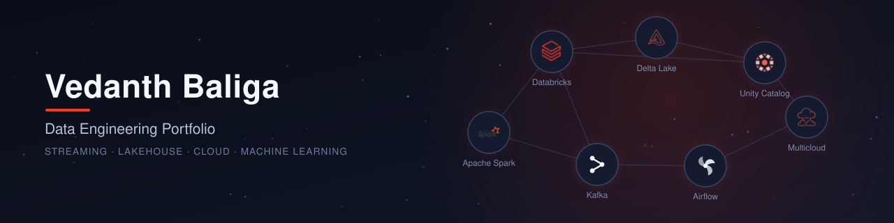

Hello World! I'm Vedanth. 

This is a complete portfolio of the projects I have designed with a major focus on implementing various data engineering tech and cloud services.

Feel Free to Connect with me 🤠

**[LinkedIn](https://www.linkedin.com/in/vedanthbaliga/) | [GitHub](https://github.com/vedanthv/)**

## Quick Links

Here is an index of projects with the tech, domain and link.

### Real Time Streaming and Analytics

| Project | Tech | 
| :---------: | :---------: |
|[Realtime Vehicle Fleet Monitoring Analysis](https://github.com/vedanthv/data-engineering-portfolio/tree/main/realtime-fleet-monitoring-analytics) |Redpanda,Apache Flink,Clickhouse,Metabase,Docker,Kubernetes|
|[InvestIQ Metrics](https://github.com/vedanthv/data-engineering-portfolio/tree/main/investiq-metrics)|AWS EC2,Docker,Airflow,ReapidAPI,AWS Lambda,AWS S3,AWS CloudWatch,AWS Redshift,Prometheus,Grafana,PowerBI|

### Databricks End to End Products

| Project | Description | Tech |
| :---------: | :---------: | :---------: |
|[Deal2Delivery](https://github.com/vedanthv/deal2delivery) ([Live Demo](https://deal2delivery-hjosuqxlm-vedanthvs-projects.vercel.app/))|Unified SAP + Salesforce demand intelligence platform on a Databricks Lakehouse — combines churn prediction and demand forecasting ML models with a Genie AI/BI space for internal analytics and a Next.js app for business stakeholders. 🏆 2nd Place Winner, Databricks DAIS 2026 Community Virtual Hackathon|Databricks (Serverless), Delta Lake, Unity Catalog, Lakeflow DLT, Databricks Asset Bundles, XGBoost, Genie AI/BI, Next.js, Vercel|

### Small Data Engineering And Analytics Projects

| Project | Tech | 
| :---------: | :---------: |
|[Pt 1 : Streaming ETL with Airflow Orchestrator and Postgres DB](https://github.com/vedanthv/data-engineering-portfolio/tree/main/cricket-livescores-ingestion-kafka-airflow)|Near Realtime Streaming,SQL Database, Kafka, Cricket!|
|[Pt 2 : Serving Postgres Data using FastAPI](https://github.com/vedanthv/data-engineering-portfolio/tree/main/cricket-livescores-fastapi)|Backend API Development, Streaming Data|
|[Pt 3 : Frontend Web App Powered by Streaming Data with Streamlit](https://github.com/vedanthv/data-engineering-portfolio/tree/main/cricket-analytics-frontend-app-streamlit)|Frontend Application Development,MVC Architecture|
|[Pt 4 : Realtime Ingestion and Transformation with Apache Druid as OLAP Database](https://github.com/vedanthv/data-engineering-portfolio/tree/main/real-time-analytics-druid) | Data Ingestion and Big Data Processing |
|[User Mingle : Kafka Driven User Profile Streaming](https://github.com/vedanthv/data-engineering-portfolio/tree/main/user-mingle)|Airflow, Zookeeper, Cassandra, Schema Registry, Spark|  
|[Grand Prix Data Odyssey](https://github.com/vedanthv/data-engineering-projects/tree/main/formula-1-analytics-engg)|Azure Databricks,Spark SQL,Postman,Blob Storage,Unity Catalog,ADF,Azure Devops,Synapse Studio, Delta Lake,PowerBI | 
|[Medal Metrics: Tokyo Olympics Data Alchemy](https://github.com/vedanthv/data-engineering-projects/tree/main/tokyo-olympics-de)|ADF,Azure Data Lake Gen2,Blob Storage,Databricks,Synapse Analytics,PowerBI|
|[Airflow with Postgres as OLTP Database [Batch Processing]](https://github.com/vedanthv/data-engineering-portfolio/tree/main/airflow-postgres-db)|Beautiful Soup, Apache Airflow, Postgres, Docker|
