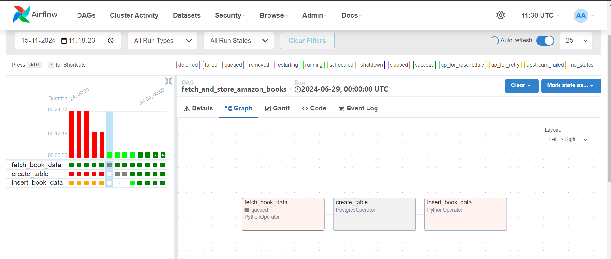
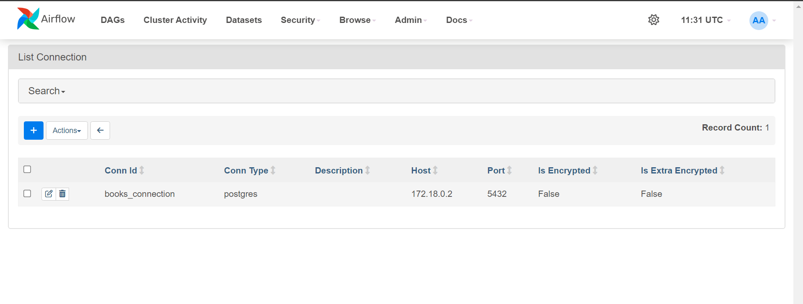
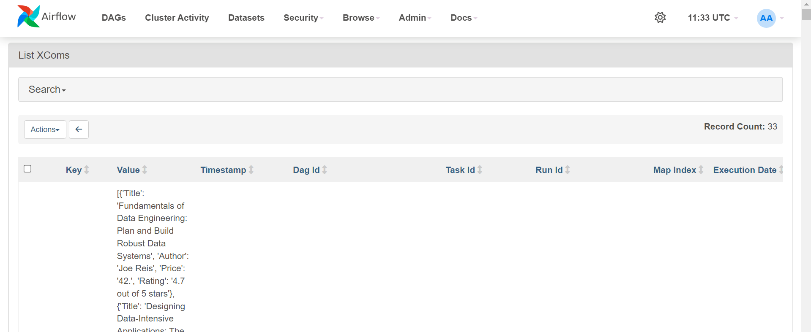
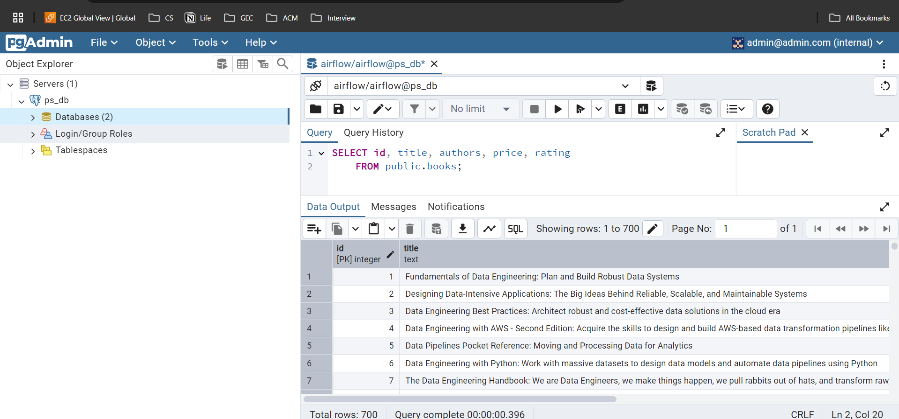

### Postgres Transactional Database powered by Airflow

This is a small learning project to scrape Amazon books data, transform it and store in Postgres Database.

I worked on this to keep a template in place anytime I'm working on Airflow and Postgres.

Content Credits : This [video](https://www.youtube.com/watch?v=3xyoM28B40Y) by Sunjana in Data.

### Steps:

1. Install Airflow as Docker compose file from https://airflow.apache.org/docs/apache-airflow/stable/howto/docker-compose/index.html

2. Follow the steps in the video and the GitHub repository https://github.com/sunjana2199/amazon_books_data_pipeline/tree/main.

Basically we are creating a server in pgadmin.

Then connecting it to Airflow.

Then we use those credentials to create connection from airflow to postgres.

The data that is getting scrapped is being stored in thee xcom using push function.

We extract it using the key in XCom using the pull function and store it in our postgres table.

**Airflow DAG UI**


**XCom and Connections**




Here key is ```book_data```.

We can get host IP by doing ```docker inspect <pgadmin_container_name>

