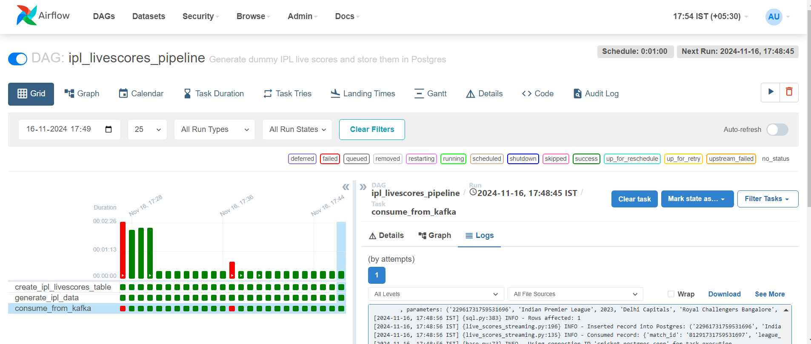
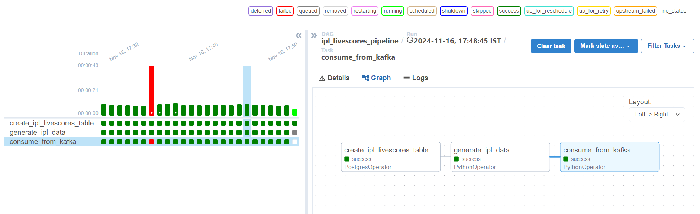
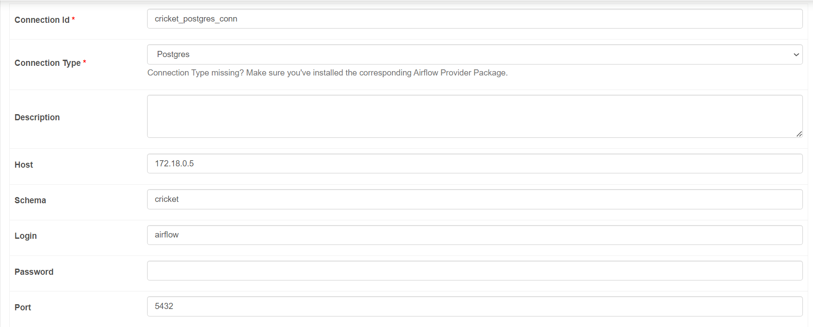

## Streaming Data using Kafka Topic and Storing in Postgres with Airflow 

In this small project, I have setup a pipeline that produces some IPL match and scores data, creates a topic **livescores_topic** and the consumer is Postgres database.

The entire pipeline is orchestrated on Airflow.

**ipl_livescores_pipeline DAG**


**Graphical Overview**


**Tasks Overview**

1. create_ipl_livescores_table

This task creates a table called ```ipl_livescores``` if it doesnt exist in PostgresDB.

```sql
CREATE TABLE IF NOT EXISTS ipl_livescores (
            match_id TEXT ,
            league_name TEXT,
            season INT,
            team1 TEXT,
            team2 TEXT,
            venue TEXT,
            match_date TEXT,
            start_time TEXT,
            match_status TEXT,
            score1 INT,
            score2 INT,
            wickets1 INT,
            wickets2 INT,
            runs1 INT,
            runs2 INT,
            overs1 FLOAT,
            overs2 FLOAT,
            man_of_the_match TEXT,
            umpire1 TEXT,
            umpire2 TEXT,
            match_type TEXT,
            toss_winner TEXT,
            batting_first TEXT,
            total_runs INT,
            extra_runs INT,
            target_runs INT,
            match_duration INT,
            winning_team TEXT
        );
```

2. Generate IPL Data

Since Cricket API's are super costly!!! upwards of 200$ a month I decided to use Faker(again!) to generate some IPL match data that has the accurate team names, players and venues as the real league but the rest is gibberish :D

```python
def generate_fake_ipl_data():

    venue = random.sample(IPL_VENUES,1)
    team1, team2 = random.sample(IPL_TEAMS, 2)  # Pick two distinct teams
    match_date = fake.date_this_year()  # Match date

    return {
        "match_id": f"{random.randint(1000, 9999)}{int(time.time() * 1000)}",  # Unique match ID
        "league_name": "Indian Premier League",
        "season": random.choice([2020, 2021, 2022, 2023, 2024]),
        "team1": team1,
        "team2": team2,
        "venue": venue,
        "match_date": match_date.strftime("%Y-%m-%d"),  # Convert to string
        "start_time": fake.time(),
        "match_status": random.choice(["Completed", "In Progress", "Scheduled"]),
        "score1": random.randint(120, 240),
        "score2": random.randint(120, 240),
        "wickets1": random.randint(0, 10),
        "wickets2": random.randint(0, 10),
        "runs1": random.randint(100, 200),
        "runs2": random.randint(100, 200),
        "overs1": round(random.uniform(10, 20), 1),
        "overs2": round(random.uniform(10, 20), 1),
        "man_of_the_match": random.choice(IPL_PLAYERS),
        "umpire1": fake.name(),
        "umpire2": fake.name(),
        "match_type": "T20",
        "toss_winner": random.choice([team1, team2]),
        "batting_first": random.choice([team1, team2]),
        "total_runs": random.randint(150, 350),
        "extra_runs": random.randint(5, 25),
        "target_runs": random.randint(150, 350),
        "match_duration": random.randint(120, 240),
        "winning_team": random.choice([team1, team2, "Tie"])
    }
```

You can check the ```IPL_PLAYERS```,```IPL_TEAMS``` and ```IPL_VENUES``` data in the file ```live_scores_streaming.py```

3. Publish to Kafka Broker

Standard code to take the data being produced as a parameter and publishing data to the Kafka topic that is listening on 9092 port.

```python
def publish_to_kafka(data):
    if not data:
        logging.info("No data to publish to Kafka.")
        return
    
    try:
        producer = KafkaProducer(
            bootstrap_servers=KAFKA_BROKER,
            value_serializer=lambda v: json.dumps(v).encode("utf-8"),
        )
        for record in data:
            logging.info(f"Publishing record to Kafka: {record}")
            producer.send(KAFKA_TOPIC, record)
        producer.flush()
        producer.close()
    except Exception as e:
        logging.error(f"Error publishing to Kafka: {e}")
```

- Here I have used ```utf-8``` serializer and the consumer group specified is ```ipl_consumer_group```

4. Consume From Kafka

```python
def consume_from_kafka():
    MAX_MESSAGES = 100  # Number of messages to consume
    consumed_count = 0  # Counter for consumed messages

    try:
        consumer = KafkaConsumer(
            KAFKA_TOPIC,
            bootstrap_servers=KAFKA_BROKER,
            value_deserializer=lambda v: json.loads(v.decode("utf-8")),
            auto_offset_reset="latest",  # Adjust as needed (earliest or latest)
            enable_auto_commit=True,       # Commit offsets after consuming
            group_id="ipl_consumer_group"  # Consistent consumer group
        )

        logging.info("Starting to consume messages from Kafka...")
        for message in consumer:
            record = message.value
            logging.info(f"Consumed record: {record}")

            # Process the record (e.g., insert into Postgres)
            insert_into_postgres(record)

            consumed_count += 1
            if consumed_count >= MAX_MESSAGES:
                logging.info(f"Consumed {MAX_MESSAGES} messages. Stopping consumer.")
                break  # Exit the loop after consuming MAX_MESSAGES

        consumer.close()  # Close the consumer properly
        logging.info("Kafka consumer task completed successfully.")

    except Exception as e:
        logging.error(f"Error consuming messages from Kafka: {e}")
        raise

```

- Here I have used the deserializer ```utf-8```. 

- The ```record-offset``` is set as ```latest``` to consider only the latest set of records from the queue.

- Once 100 records are consumed close the consumer and end the task.

5. Insert Data into Postgres

```python
# Insert data into Postgres
def insert_into_postgres(record):
    try:
        postgres_hook = PostgresHook(postgres_conn_id="cricket_postgres_conn")
        insert_query = """
        INSERT INTO ipl_livescores (
            match_id, league_name, season, team1, team2, venue, match_date, start_time, match_status,
            score1, score2, wickets1, wickets2, runs1, runs2, overs1, overs2, man_of_the_match,
            umpire1, umpire2, match_type, toss_winner, batting_first, total_runs, extra_runs,
            target_runs, match_duration, winning_team
        ) 
        VALUES (%s, %s, %s, %s, %s, %s, %s, %s, %s, %s, %s, %s, %s, %s, %s, %s, %s, %s, %s, %s, %s, %s, %s, %s, %s,%s,%s,%s);
        """
        parameters = (
            record["match_id"],
            record["league_name"],
            record["season"],
            record["team1"],
            record["team2"],
            record["venue"],
            record["match_date"],
            record["start_time"],
            record["match_status"],
            record["score1"],
            record["score2"],
            record["wickets1"],
            record["wickets2"],
            record["runs1"],
            record["runs2"],
            record["overs1"],
            record["overs2"],
            record["man_of_the_match"],
            record["umpire1"],
            record["umpire2"],
            record["match_type"],
            record["toss_winner"],
            record["batting_first"],
            record["total_runs"],
            record["extra_runs"],
            record["target_runs"],
            record["match_duration"],
            record["winning_team"],
        )
        postgres_hook.run(insert_query, parameters=parameters)
        logging.info(f"Inserted record into Postgres: {parameters}")

    except Exception as e:
        logging.error(f"Error inserting into Postgres: {e}")
```

- Straighforward use of PostgresHook to insert data into the table.

- I have created a connection from Postgres that has
    - Host Name \ IP : the Host IP of the docker container running postgres. 
      [we can find out using ```docker inspect <container_id>]
    - username : airflow [anything else is fine]
    - password : airflow [anything else is fine]

- In Airflow as well, we create a connection:



- Now the above function will work since we all connections in place.

The rest of it below just uses the above functions ...

```python
    # Generate fake IPL match data
    generate_ipl_data_task = PythonOperator(
        task_id="generate_ipl_data",
        python_callable=lambda: publish_to_kafka([generate_fake_ipl_data() for _ in range(100)]),  # Generate 100 records
    )

    # Consume from Kafka and insert into Postgres
    consume_from_kafka_task = PythonOperator(
        task_id="consume_from_kafka",
        python_callable=consume_from_kafka,
    )

    # Set task dependencies
    create_table_task >> generate_ipl_data_task >> consume_from_kafka_task
```

