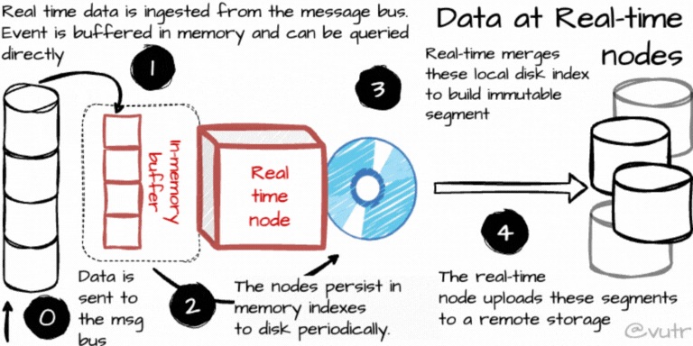
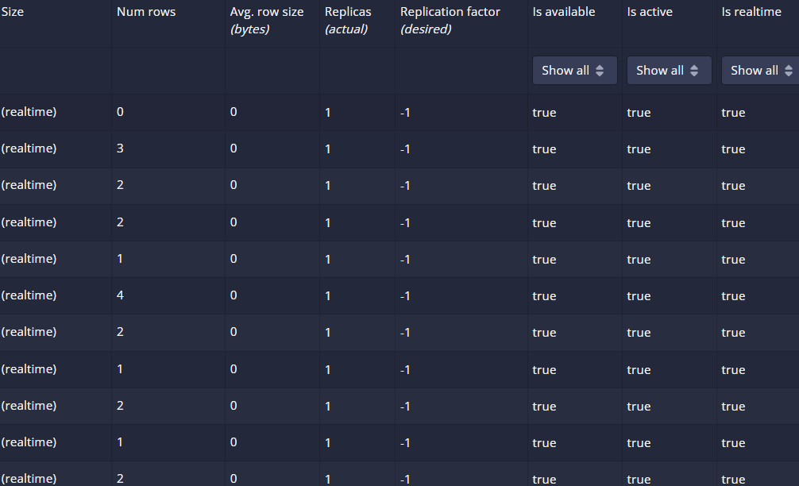

# 💵 🦹 Dabbling with Apache Druid : Realtime Analytics Engine

Multiple Case Studies in various domains that I experimented using Apache Druid as a real time analytics database for efficient and low latency querying on streaming data source sending excess of 100k messages a second.

I have demonstrated and benchmarked most of the features available in Druid.

🚀 Its not a complete project like some of the others here, but just a depiction of how I learn new tech practically in a(or a couple) weekend(s) :)


Already Know about Druid, want to skip to the boring parts? Click [here](https://github.com/vedanthv/data-engineering-portfolio/tree/main/real-time-analytics-druid#experiments-with-a-single-table)

# Project Setup and Troubleshooting Guide

If you would like to emulate the project on your system follow these steps.

## Non Docker Setup

### Very Important Stuff to Note

I sepnt lot of time SSH'ing into the EC2 instance from VSCode.

Its kind of pointless and doesnt work like before, so best way if you are not using Docker is to 
create multiple terminals and SSH into each one of them.

We need to do this because the SSH session terminates within 15-20 min, and then we need to stop the EC2, get the new public address and again connect. Its a pain. [Solution??](https://codewithsusan.com/notes/vscode-remote-ssh-connection-issues#:~:text=Why%20this%20happens,is%20to%20restart%20the%20server.) 


So...

In one terminal, SSH into it ... like this : ssh -i "D:\...pem" ubuntu@ec2-xx-xxx-xxx-xxx.ap-south-1.compute.amazonaws.com

Start the broker service as mentioned below... in *Setup Kafka Broker*

Open another terminal, SSH into it... in same way and run the Druid setup instructions in *Setup Druid*

In the 3rd and final terminal, run python3 main.py to start generating the messages. make sure the topic name and the broker ports are correct.

Well one disadv of this is that we cant use VSCode to edit anything :( so I need to figure out a solution to this fast.

But... if you are not using Docker then the only real thing to code would be the main.py file that produces the data which you can do on Vim also :)

### Setup Druid

https://dev.to/aws-builders/how-to-deploy-apache-druid-on-aws-ec2-instance-5hib

```
1) sudo apt update -y
2) sudo apt install openjdk-8-jdk -y
3) wget https://dlcdn.apache.org/druid/29.0.1/apache-druid-29.0.1-bin.tar.gz (Last updated version)
4) tar -xzf apache-druid-29.0.1-bin.tar.gz
5) cd apache-druid-29.0.1
6) export JAVA_HOME=/usr/lib/jvm/java-8-openjdk-amd64
7) export DRUID_HOME=/home/ubuntu/apache-druid-29.0.1
8) PATH=$JAVA_HOME/bin:$DRUID_HOME/bin:$PATH
```

### Run Druid

```
./bin/start-micro-quickstart
```

Druid will run on 

```
AWS Public IPv4 address:8888
``` 
Not on your localhost.

### Set up basic Kafka Broker

https://kafka.apache.org/quickstart

```
$ tar -xzf kafka_2.13-3.9.0.tgz
$ cd kafka_2.13-3.9.0
```

### Install Java JDK 8

https://www.digitalocean.com/community/tutorials/how-to-install-java-with-apt-on-ubuntu-22-04

### Start Broker

```
$ ./bin/kafka-server-start.sh config/server.properties
```


Create topic

```
./bin/kafka-topics.sh --create --topic kttm --bootstrap-server localhost:9092
```

**Error : Cluster Id Doesnt match**

https://stackoverflow.com/questions/59481878/unable-to-start-kafka-with-zookeeper-kafka-common-inconsistentclusteridexceptio


**IMP!!! Since Druid itself starts a Zookeeper we dont need to start one more while creating broker.**

### Error: Port 2181 is already binded

https://stackoverflow.com/questions/11583562/how-to-kill-a-process-running-on-particular-port-in-linux


Prefix all commands by sudo

### What if processes on port 2181 keep spawning?

https://stackoverflow.com/questions/59481878/unable-to-start-kafka-with-zookeeper-kafka-common-inconsistentclusteridexceptio


This legit works for all kinds of errors!!

### Start Producing Data into the broker

- Now that everything is setup, 

Run

```
python3 main.py
```

To start the creation of messages into the message queue.

### How to Configure Druid to read from the broker and the topic

https://druid.apache.org/docs/latest/tutorials/tutorial-kafka/#load-data-into-druid

# What is Apache Druid?

Apache Druid is one of the most famous and extensively used realtime OLAP analytics databases that was introduced by MetaMarket in 2014.

MapReduce and Hadoop was conceptualised by Google in 2004 for large scaled data processing but one of the major drawbacks was that it could not handle large scale event streaming data efficiently.

Metamarket is a company that focuses on providing market insights to sales executives and organizations whose products guarantee efficient query performance. After realizing that Hadoop and other open source products could not give these guarantees, they build Druid : a real time data store.

The other major aspect of buildiing Druid was to provide high availability since any downtime of critical dashboards and data, may result in significant loss to a business in the vertical of FMCG, AdTech etc... that heavily rely on marketing insights for split second decisions.

# Components of Apache Druid

**All Images and content in this section is picked from and concised!** : https://blog.det.life/the-architecture-of-apache-druid-e92d64ba4360 
(credits to Vu Trinh!)


## Real Time Nodes

A real-time node (also called a Real-Time Server or Middle Manager node) is responsible for ingesting real-time data, processing it, and making it available for querying almost immediately. Druid is designed to handle large volumes of real-time streaming data with low-latency query responses.

- Real-time nodes are responsible for ingesting data from streaming sources like Apache Kafka, HTTP, or any other data stream.

- They use ingestion spec (JSON) to define how the data should be ingested, parsed, and transformed.

- The node consumes events in real time, processes them (e.g., filtering, transformation), and stores them in an intermediate data structure.

- Real-time nodes take the incoming data and perform indexing. This process involves transforming the raw data into a columnar format (specifically, Druid's segment format).
The node writes this data to real-time segments in memory first and eventually persists them to disk when they reach a certain size or age.

- As soon as the data is ingested and indexed, it becomes available for queries. In Druid, queries can be made with near real-time latency, which is critical for applications requiring up-to-the-minute data access.

- The data on the real-time node is eventually persisted into deep storage and can be used by historical nodes for more efficient querying over long time periods.

- We can have multiple real time nodes that can ingest the same data guaranteeing data resiliency and multiple real time nodes can also ingest different partitions of the same stream, so load balancing can be acheived.



Credits : Vu Trinh

## Why use Kafka?

One question that you may ask is, why do we use Kafka here if we can directly stream to real time nodes. 

We use Kafka streams because it provides checkpoint/offset capability that informs the real time node about the data offset from where it needs to start ingesting data.

Incase the real time node goes down, the Kafka broker can tell the node the offset position once its back up to avoid unnecessary data redundancy.

## Historical Nodes

**Long-Term Data Storage:** Historical nodes store finalized, immutable segments of data that have been ingested and processed. They are designed to manage and serve large volumes of historical data efficiently.

**Optimized Query Performance:** These nodes are optimized for high-performance querying by holding segments in memory and on disk, ensuring quick access to data. Queries on historical nodes generally perform faster than on real-time nodes due to their optimized storage format.

**Deep Storage Integration:** Historical nodes fetch segments from deep storage (e.g., HDFS, S3, Google Cloud Storage) as needed and cache them locally. This allows Druid to manage data efficiently, even across large datasets, by only loading segments relevant to incoming queries.

Like real-time nodes, historical nodes announce their online state and the data they serve in Zookeeper. Druid will send the instructions for historical nodes on how to load and drop segments to the Zookeeper. The instructions also have information about where the segment is located in deep storage and how to decompress and process the segment.

Historical Nodes always check the local cache first before checking the deep storage for sending information to a query.

After downloading it, they announce its status to the Zookeeper. Because they only deal with immutable data, Historical nodes can ensure consistency when executing reading on the segments. Immutability also lets Druid achieve parallelization more efficiently when it is not concerned about whether any process modifies the data.


### Hot and Cold Tiered Clusters

Apache Druid supports tiered historical storage to optimize performance and cost, typically using Hot and Cold storage tiers for historical data. Here’s how it works:

1. Hot Storage Tier:
Purpose: Hot storage is used for recent, frequently queried data. It is optimized for high-speed access and low query latency.

Storage Type: This tier generally uses fast storage, such as SSDs or high-performance disks, to ensure quick data retrieval.

Caching: Data in the hot tier is often cached in memory to further reduce access time for frequently queried segments.

Resource Allocation: Historical nodes in the hot tier are configured with more CPU and memory resources to handle the high throughput and query demands of recent data.

2. Cold Storage Tier:
Purpose: Cold storage is intended for older, less frequently accessed data. This tier prioritizes storage cost savings over query speed.

Storage Type: Typically uses slower, cost-effective storage options, such as HDDs, since data in this tier is accessed less frequently.

On-Demand Loading: Data in the cold tier may be loaded on-demand into memory only when queried, allowing Druid to reduce memory and compute overhead for older data.

Resource Allocation: Nodes in the cold tier have lower resource allocations (less memory, slower storage) than hot-tier nodes, minimizing infrastructure costs.

Users can set up the “hot” tier of historical nodes with high CPUs and memory. The “hot” cluster will download more frequently accessed data. In addition, the “cold” one would only contain less frequently accessed segments.

## Broker Nodes

Broker Nodes in Apache Druid are essential components in the cluster responsible for managing queries and optimizing the way data is retrieved and returned to users. Here are the key points about Broker Nodes:

1. Query Routing and Coordination:
Broker nodes receive queries from users and act as intermediaries, distributing query fragments to the appropriate historical and real-time nodes where the data resides.
Brokers understand the segment metadata in the cluster, enabling them to route each part of the query to the exact node(s) with the relevant data.

2. Query Merging and Aggregation:
Once the query results are returned from historical or real-time nodes, the broker node consolidates, merges, and applies any necessary aggregations or sorting on the results.
This processing minimizes the data sent back to the client, improving efficiency and reducing network overhead.

3. Caching:
Broker nodes provide a result-level caching layer to speed up query responses for frequently accessed data. They cache the results of commonly requested segments in memory, which can reduce query latency significantly.

Caching can be configured at various levels: local caches on each broker node and global caches across the broker nodes, providing flexibility to optimize performance.

4. Load Balancing and Fault Tolerance:
In a Druid cluster, multiple broker nodes can be deployed for load balancing and redundancy. This setup distributes query loads across brokers, enhancing the system’s resilience and scalability.

If one broker node fails, queries can be routed to another broker node, ensuring high availability.

5. Query Optimization and Cost Control:
Brokers optimize queries by minimizing the number of segments and rows scanned, lowering query costs and response times.
Druid’s query execution plan on broker nodes identifies and skips segments that aren’t needed based on the query, further improving efficiency.

These nodes have cache implementation with a LRU strategy. The cache can use local heap memory or an external store such as Memcached. When a broker node receives a query, it maps the query to a set of segments. The query results may already exist in the cache, so re-processing them is unnecessary. For any results that do not exist in the cache, the broker node will forward the query to the correct nodes:

For the results from the historical node, the broker will cache these results on a per-segment basis for future use.

The broker never caches the results from the real-time nodes. This ensures the query is always processed by the real-time node, which guarantees the freshness of the result.

The broker nodes are critical to routing queries to the processing nodes. They must communicate with the Zookeeper for the segment-nodes mapping to do this. 

In the case of a Zookeeper failure, broker nodes use the cluster’s latest known state (the last metadata from the previous successful Zookeeper communication). Broker nodes will assume that the cluster’s state is the same as before the failure.


## Coordinator Nodes

Coordinator Nodes in Apache Druid are responsible for managing data distribution, load balancing, and cluster resource optimization. Here’s a breakdown of the key roles and functions of coordinator nodes:

1. Segment Management and Balancing:
Coordinator nodes handle segment distribution across historical nodes to ensure optimal load balancing in the cluster.

They monitor each historical node's storage and load, redistributing segments as needed to balance storage use and query performance across the cluster.

2. Data Retention and Tiering:
Coordinators enforce data retention policies by managing which segments are retained, archived, or deleted based on configured rules.
They also handle tiered storage (e.g., hot and cold storage tiers), automatically moving segments between storage tiers as data ages, optimizing resource use for cost and performance.

3. Deep Storage Management:
The coordinator node manages the movement of data to deep storage (e.g., HDFS, S3, or GCS). This includes archiving data and ensuring that segments are safely backed up for fault tolerance and long-term storage.
Deep storage integration allows the coordinator to reload any segments that historical nodes might need or lose, maintaining data availability even if segments are purged from historical nodes’ local storage.

4. Overlord Coordination for Task Management:
The Coordinator works closely with the Overlord to monitor and manage data ingestion tasks. The Overlord primarily manages ingestion tasks on real-time nodes, while the Coordinator ensures that completed tasks' data is properly distributed and available on historical nodes.
This coordination helps ensure that data is smoothly transitioned from ingestion to long-term storage and is accessible for queries.

5. Cluster Health and Scalability:
Coordinator nodes regularly check the health of other nodes (historical, real-time, and broker nodes) and take corrective actions if issues arise, such as reassigning segments or triggering alerts.
They help scale the cluster by managing segment distribution across new nodes added to the cluster, supporting seamless scaling without downtime.

These nodes are also connected to a MySQL database, which stores additional operational parameters and configurations. The MySQL database stores a rule table that controls how segments are created, destroyed, and replicated in the cluster.

- How segments should be assigned to different historical node tiers?
- How many replicates of a segment should exist in each tier?
- When to drop segments?

The coordinator nodes also ensure the cluster’s balance by controlling the distribution of the segments. Furthermore, coordinator nodes can tell the historical nodes to load a copy of the same segment to increase and achieve better fault tolerance and availability; the number of replicas can be configurable.

## Segments : Columnar Data Format of Druid

- Tables in Druid are stored in segments of 5-6 million rows each and are partitioned by timestamp.

- Replication is done at the segment level and timestamp is required for every table so that data distribution is easier.

- Segments have a unique identifier and are often versioned. Some of the segments that are queried frequently are stored in the broker's cache whereas the rest is in historical storage.

Read operations in Druid always read data in a particular time range from the segments with the latest version. 

Segments are stored in the remote storage in columnar format; this allows for more efficient CPU usage: only needed data is loaded. 

Druid has multiple column types to support many data formats. Druid will apply different compression schemes on different data types to compress data on the disk or memory more efficiently.


## Scatter and Gather Approach of Broker


# Experiments with a single table

Here are some visuals where I try out Apache Druid with just one table that has some financial transactional data.

- There is only one broker that consumes data from a python file that has code to produce 100,000 messages per second.
- All components listed above are spun up as shown in the video demo.
- There is a common zookeeper that manages both the broker and druid services.
- The entire setup is on a ```t2.medium``` EC2 instance type and ```ubuntu 24.04``` img/image.
- The demo and the benchmarking was done on a non docker setup but you can use the ```docker-compose.yml``` script in the repo to follow along with Docker pre setup.
- **Cost of AWS Services on Avg** : Around 8$ over a period of 3 weeks and 100 hours of uptime.

## Video Demo

https://github.com/user-attachments/assets/dcb3ac53-7145-4338-b8d9-aee9944aa410

## Overview


## Extensions


## Services Running


## Leader and Worker Node


## Parsed Data from JSON


## Partitioning by Timestamp


Druid partitions data based on the primary time column of your data. This column is stored internally in Druid as __time.

## Realtime Filtering Capability


Here I have filtered rows where the transaction type is "payment". 

## Query Granularity


Granularity determines how to bucket data across the time dimension, or how to aggregate data by hour, day, minute, etc and defines how it is stored. The granularity formats here apply also to segmentGranularity and queryGranularity in the granularitySpec section of the the ingestion spec.

## Powerful Feature of Druid : Efficient Partition by Time

Configure how Druid will partition data.

Druid datasources are always partitioned by time into time chunks (Primary partitioning), and each time chunk contains one or more segments (Secondary partitioning).

## Tuning Feature

It decides various factors like the number of rows that can be stored in the memory before pushing it to the disk.

Refer : https://druid.apache.org/docs/31.0.0/ingestion/ingestion-spec/#tuningconfig

## Final Nail : JSON Ingestion Spec

- Note that Druid tries to keep data in memory cache as much as possible before moving it to the db.

- The ingestion spec json gives details of all the transformations and filtering that we did.


## Submitting the Spec to the Supervisor


## Supervisor Indexes the data in the **kttm** topic


The status of each task running on the supervisor port 8100 is displayed here


## Segmentation of the Data by Time

- In the below example there is one segment for each day.

- Spapshot versioning of the data in each segment takes place at regular intervals.

- We can also see various otther metrics like replicas, replica factor, IsAvailable? , IsActive? , IsRealTime? etc..



- This feature is called "auto batching" in Druid.

- If a segment is corrupted we can rebuild that segment without affecting the other partitions of the  data.

## Realtime Superfast Querying

Once the supervisor builds the table for us with the partitions, we can start querying the data.
Look at how fast the queries get executed!!

Barely takes 0.1s to read in 800 records!


## Benchmarking

Increasing the producer speed to send 1000 records per sec...


100000 records per second...


Grouping Operations for 400,000+ records happens within 0.30 seconds!


## Time Aggregation

Let us do some aggregation based on the time where the total_amount (basically the cash from bank)
that flows in and out per minute.


