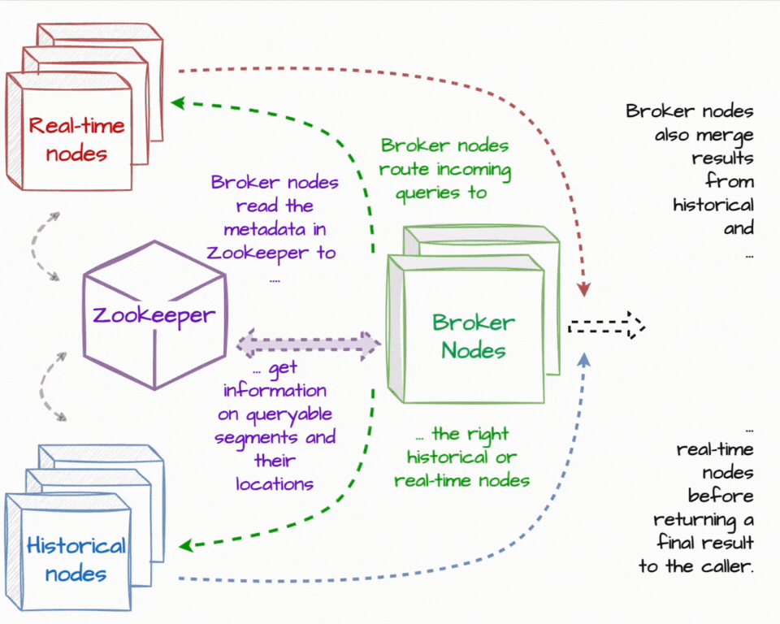
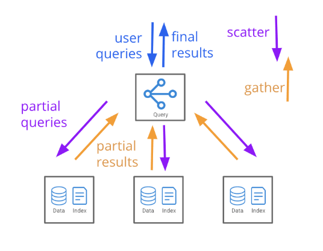
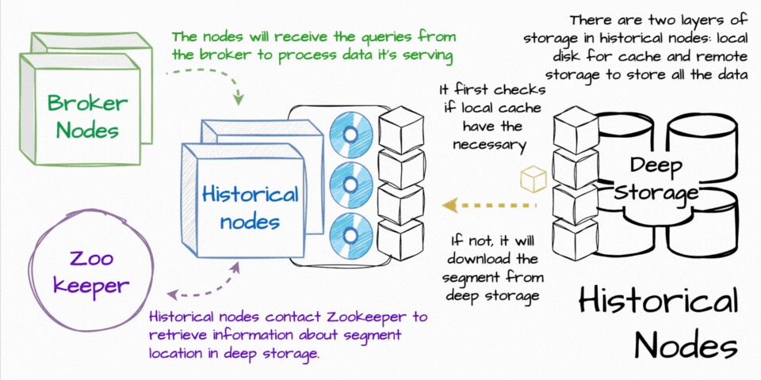

# 💵 🦹 FlashMetrics Financial Intelligence

# Some Visuals

## Video Demo

Add video here

## Overview



## Extensions


## Services Running



## Leader and Worker Node


## Parsed Data from JSON


## Partitioning by Timestamp


Druid partitions data based on the primary time column of your data. This column is stored internally in Druid as __time.

## Realtime Filtering Capability


Here I have filtered rows where the transaction type is "payment". 

## Query Granularity


Granularity determines how to bucket data across the time dimension, or how to aggregate data by hour, day, minute, etc and defines how it is stored. The granularity formats here apply also to segmentGranularity and queryGranularity in the granularitySpec section of the the ingestion spec.

## Powerful Feature of Druid : Efficient Partition by Time

Configure how Druid will partition data.

Druid datasources are always partitioned by time into time chunks (Primary partitioning), and each time chunk contains one or more segments (Secondary partitioning).

## Tuning Feature

It decides various factors like the number of rows that can be stored in the memory before pushing it to the disk.

Refer : https://druid.apache.org/docs/31.0.0/ingestion/ingestion-spec/#tuningconfig

## Final Nail : JSON Ingestion Spec

- Note that Druid tries to keep data in memory cache as much as possible before moving it to the db.

- The ingestion spec json gives details of all the transformations and filtering that we did.


# Troubleshooting Guide

## Non Docker Vanilla Setup

### Very Important Stuff to Note

I sepnt lot of time SSH'ing into the EC2 instance from VSCode.

Its kind of pointless and doesnt work like before, so best way if you are not using Docker is to 
create multiple terminals and SSH into each one of them.

We need to do this because the SSH session terminates within 15-20 min, and then we need to stop the EC2, get the new public address and again connect. Its a pain.

So...

In one terminal, SSH into it ... like this : ssh -i "D:\...pem" ubuntu@ec2-xx-xxx-xxx-xxx.ap-south-1.compute.amazonaws.com

Start the broker service as mentioned below... in *Setup Kafka Broker*

Open another terminal, SSH into it... in same way and run the Druid setup instructions in *Setup Druid*

In the 3rd and final terminal, run python3 main.py to start generating the messages. make sure the topic name and the broker ports are correct.

Well one disadv of this is that we cant use VSCode to edit anything :( so I need to figure out a solution to this fast.

But... if you are not using Docker then the only real thing to code would be the main.py file that produces the data which you can do on Vim also :)

### Setup Druid

https://dev.to/aws-builders/how-to-deploy-apache-druid-on-aws-ec2-instance-5hib

```
1) sudo apt update -y
2) sudo apt install openjdk-8-jdk -y
3) wget https://dlcdn.apache.org/druid/29.0.1/apache-druid-29.0.1-bin.tar.gz (Last updated version)
4) tar -xzf apache-druid-29.0.1-bin.tar.gz
5) cd apache-druid-29.0.1
6) export JAVA_HOME=/usr/lib/jvm/java-8-openjdk-amd64
7) export DRUID_HOME=/home/ubuntu/apache-druid-29.0.1
8) PATH=$JAVA_HOME/bin:$DRUID_HOME/bin:$PATH
```

### Run Druid

```
./bin/start-micro-quickstart
```

Druid will run on 

```
AWS Public IPv4 address:8888
``` 
Not on your localhost.

### Set up basic Kafka Broker

https://kafka.apache.org/quickstart

```
$ tar -xzf kafka_2.13-3.9.0.tgz
$ cd kafka_2.13-3.9.0
```

### Install Java JDK 8

https://www.digitalocean.com/community/tutorials/how-to-install-java-with-apt-on-ubuntu-22-04

### Start Broker

```
$ ./bin/kafka-server-start.sh config/server.properties
```


Create topic

```
./bin/kafka-topics.sh --create --topic kttm --bootstrap-server localhost:9092
```

**Error : Cluster Id Doesnt match**

https://stackoverflow.com/questions/59481878/unable-to-start-kafka-with-zookeeper-kafka-common-inconsistentclusteridexceptio


**IMP!!! Since Druid itself starts a Zookeeper we dont need to start one more while creating broker.**

### Error: Port 2181 is already binded

https://stackoverflow.com/questions/11583562/how-to-kill-a-process-running-on-particular-port-in-linux



Prefix all commands by sudo

### What if processes on port 2181 keep spawning?

https://stackoverflow.com/questions/59481878/unable-to-start-kafka-with-zookeeper-kafka-common-inconsistentclusteridexceptio


This legit works for all kinds of errors!!

### Start Producing Data into the broker

- Now that everything is setup, 

Run

```
python3 main.py
```

To start the creation of messages into the message queue.

### How to Configure Druid to read from the broker and the topic

https://druid.apache.org/docs/latest/tutorials/tutorial-kafka/#load-data-into-druid

# Some Visuals

## Overview


## Extensions


## Services Running


## Leader and Worker Node


## Parsed Data from JSON


## Partitioning by Timestamp


Druid partitions data based on the primary time column of your data. This column is stored internally in Druid as __time.

## Realtime Filtering Capability


Here I have filtered rows where the transaction type is "payment". 

## Query Granularity


Granularity determines how to bucket data across the time dimension, or how to aggregate data by hour, day, minute, etc and defines how it is stored. The granularity formats here apply also to segmentGranularity and queryGranularity in the granularitySpec section of the the ingestion spec.

## Powerful Feature of Druid : Efficient Partition by Time

Configure how Druid will partition data.

Druid datasources are always partitioned by time into time chunks (Primary partitioning), and each time chunk contains one or more segments (Secondary partitioning).

## Tuning Feature

It decides various factors like the number of rows that can be stored in the memory before pushing it to the disk.

Refer : https://druid.apache.org/docs/31.0.0/ingestion/ingestion-spec/#tuningconfig

## Final Nail : JSON Ingestion Spec

- Note that Druid tries to keep data in memory cache as much as possible before moving it to the db.

- The ingestion spec json gives details of all the transformations and filtering that we did.


