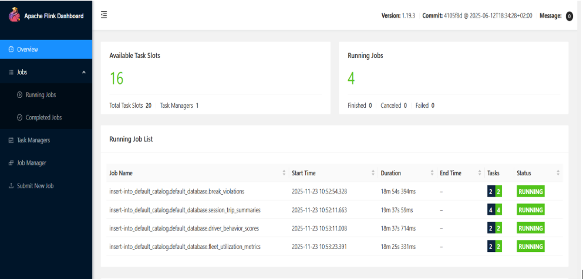

# Realtime Fleet Monitoring Analysis with Flink

This project solves a core problem in modern fleet and mobility operations: the need to monitor thousands of vehicles in real time, detect risky driving patterns early, and optimize operational efficiency. 

Businesses such as logistics companies, ride-hailing platforms, last-mile delivery services, and asset-tracking providers rely on continuous telemetry from vehicles to ensure safety, reduce fuel and maintenance costs, and respond instantly to incidents. 

By processing high-velocity telemetry streams with Apache Flink, this system provides immediate insights into trip behavior, driver performance, vehicle health, and operational anomalies. 

The resulting real-time analytics enable businesses to make faster decisions, prevent accidents, minimize downtime, improve driver accountability, and enhance customer service through more accurate ETAs and proactive issue detection.

Below is a dashboard that's benchmarked to ingested **100,000 events per second** into Redpanda, transformed in realtime using Apache Flink, storing the transformed data in Clickhouse and using Metabase for realtime 5 second refresh dashboards.

🚀 The entire project is build on a **t2.medium AWS EC2 VM with 100GB EBS storage**.


## Business Use Cases

### 1. Driver Behavior Monitoring

- Detect overspeeding, harsh braking, aggressive acceleration.
- Score drivers over rolling windows.
- Reduce accidents and insurance premiums.

### 2. Trip Intelligence

- Track trip start/end automatically.
- Compute distance, duration, idle time.
- Monitor ETA accuracy and route compliance.

### 3. Delivery Optimization

- Detect bottlenecks in last-mile delivery.
- Measure loading/unloading delays.
- Improve SLA adherence.

### 4. Fleet Utilization Insights

- Under-utilized vehicles.
- Multi-trip anomalies.
- Asset downtime monitoring.

### 6. Real-time Alerts & Operations Dashboard

- Overspeed alerts.
- Idling alerts.
- Geofence violations.
- SOS & crash detection.

## Architecture

---

| Layer                               | Component                                              | Purpose / Role                                                                 | Key Responsibilities                                                                                                                                                                                                          | Why This Component?                                                                                                                      |
| ----------------------------------- | ------------------------------------------------------ | ------------------------------------------------------------------------------ | ----------------------------------------------------------------------------------------------------------------------------------------------------------------------------------------------------------------------------- | ---------------------------------------------------------------------------------------------------------------------------------------- |
| **Ingestion Layer**                 | **Redpanda (Kafka-API Compatible Streaming Platform)** | High-throughput ingestion of telemetry, driver events, trip events, and alerts | • Accepts JSON telemetry events at high EPS<br>• Durable, replicated event storage<br>• Topic partitioning for parallel consumption<br>• Acts as source of truth for raw events                                               | • Drop-in Kafka replacement but faster + simpler<br>• No ZooKeeper<br>• Low-latency writes suitable for IoT telemetry                    |
| **Stream Processing Layer**         | **Apache Flink (Streaming SQL + CEP)**                 | Real-time computation, enrichment, sessionization, and alerting                | • Windowed aggregations (tumble/hop/session)<br>• Driver behavior scoring<br>• Trip/session detection<br>• CEP rules for overspeed, harsh brake<br>• Data cleansing + transformations<br>• Writes prepared data to ClickHouse | • Best stream processor for stateful workloads<br>• Checkpoints, exactly-once semantics<br>• SQL + Python + DataStream API flexibility   |
| **Storage / OLAP Layer**            | **ClickHouse (OLAP Columnar DB)**                      | Fast analytics + dashboards on telemetry data                                  | • Stores telemetry facts<br>• Stores trip/session facts<br>• Driver score marts<br>• Alert history<br>• Materialized views for aggregation<br>• Sub-second queries for dashboards                                             | • Extremely fast for time-series & geo data<br>• MergeTree handles millions of rows/sec<br>• Affordable and scalable for fleet analytics |
| **Analytics / Visualization Layer** | **Metabase**                                           | BI dashboards + self-service exploration                                       | • Driver score dashboards<br>• Trip KPIs<br>• Alert trends<br>• Heatmaps (with custom queries)<br>• Ad hoc analysis for operations team                                                                                       | • Simple, free, and integrates directly with ClickHouse<br>• Great for internal fleet operations dashboards                              |

### High Level Architecture


### Flink Pipelines and Clickhouse Architecture


### Docker Deployment


### Kubernetes Deployment


# Setup

## Clone the repository

```git clone https://github.com/vedanthv/data-engineering-portfolio.git```

Navigate to ```realtime-fleet-montioring-analytics``` folder.

## Install JAR Files for Apahce Flink

Install the following jar files and keep them in ```sql-client/lib``` folder.

1. flink-connector-kafka_2.12-1.12.0.jar
2. flink-json-1.19.0.jar
3. flink-sql-connector-kafka-3.1.0-1.18.jar
4. kafka-clients-3.4.0.jar

[All the jar files are here](https://github.com/vedanthv/data-engineering-portfolio/tree/main/realtime-fleet-monitoring-analytics/sql-client/lib)

## Docker

Spin up all the services by running:

```
cd docker
sudo docker compose up -d
```

This starts the Redpanda broker and console. Please check the docker compose [file](https://github.com/vedanthv/data-engineering-portfolio/tree/main/realtime-fleet-monitoring-analytics/docker) for info on the ports.

## Start the Producer

```bash
python data-producer.py \
  --brokers localhost:9092 \
  --num-vehicles 5 \
  --telemetry-rate 1 \
  --run-seconds 30
```

### Command-Line Arguments

| Argument           | Description                               | Default          |
| ------------------ | ----------------------------------------- | ---------------- |
| `--brokers`        | Bootstrap servers                         | `localhost:9092` |
| `--num-vehicles`   | Number of simulated vehicles              | `10000`          |
| `--telemetry-rate` | Telemetry messages per second per vehicle | `1.0`            |
| `--run-seconds`    | How long to run the simulation            | `3600`           |
| `--create-topics`  | Create required topics                    | Disabled         |

## Initialize and submit Flink jobs

All the flink sql DDL's and transforms is documented [here](https://github.com/vedanthv/data-engineering-portfolio/blob/main/realtime-fleet-monitoring-analytics/flink-transforms.sql).

Run the following commands to initialize jobs.

```bash
chmod +x scripts/run-flink-jobs.sh

./run-flink-jobs.sh
```

This will initialize all flink jobs, the details are in the next part of the documentation.

You should be able to see a screen like this on the Flink UI.



## Create Clickhouse Tables and Materialized Views

To create Clickhouse Tables and Materialized Views run the following shell script.

```bash
chmod +x scripts/run-clickhouse-scrips.sh

./run-clickhouse-scrips.sh
```

More details about the architecture is mentioned in the next part of the documentation.

## Metabase Setup [TODO]

# Implementation in depth

## Data Producer

### Features

* Multiple topic outputs:

  * `fleet.prod.telemetry.raw` – high-frequency telemetry
  * `fleet.prod.trip.events` – trip start/end events and summaries
  * `fleet.prod.vehicle.status` – periodic vehicle health
  * `fleet.prod.events.driver` – driver login/logout and activity events
  * `fleet.prod.alerts.outbound` – alert events such as overspeed
  * `fleet.prod.commands` – optional command topic
* Configurable number of vehicles and telemetry rate
* Automatic topic creation (optional)
* Threaded per-vehicle simulation
* Realistic GPS movement using Haversine distance and interpolation

### Installation

Ensure Kafka or Redpanda is running and reachable at the bootstrap server address.

### Quick Start

Run a small test with 5 vehicles for 30 seconds:

```bash
python data-producer.py \
  --brokers localhost:9092 \
  --num-vehicles 5 \
  --telemetry-rate 1 \
  --run-seconds 30
```

## Command-Line Arguments

| Argument           | Description                               | Default          |
| ------------------ | ----------------------------------------- | ---------------- |
| `--brokers`        | Bootstrap servers                         | `localhost:9092` |
| `--num-vehicles`   | Number of simulated vehicles              | `10000`          |
| `--telemetry-rate` | Telemetry messages per second per vehicle | `1.0`            |
| `--run-seconds`    | How long to run the simulation            | `3600`           |
| `--create-topics`  | Create required topics                    | Disabled         |

## Example Messages

### Telemetry (`fleet.prod.telemetry.raw`)

```json
{
  "event_id": "uuid",
  "vehicle_id": "veh_1000",
  "driver_id": "drv_2000",
  "trip_id": "trip_veh_1000_1700000000",
  "timestamp": "2025-11-30T12:00:00Z",
  "lat": 12.9123456,
  "lon": 77.6123456,
  "speed_kmph": 45.2,
  "heading": 130.1,
  "sat_count": 9,
  "battery_v": 12.3
}
```

### Trip Event (`fleet.prod.trip.events`)

```json
{
  "trip_id": "trip_veh_1000_1700000000",
  "vehicle_id": "veh_1000",
  "driver_id": "drv_2000",
  "event_type": "trip_start",
  "timestamp": "2025-11-30T12:00:00Z",
  "origin_lat": 12.91,
  "origin_lon": 77.61
}
```

### Alert (`fleet.prod.alerts.outbound`)

```json
{
  "alert_id": "uuid",
  "ts": "2025-11-30T12:05:00Z",
  "vehicle_id": "veh_1000",
  "trip_id": "trip_veh_1000_1700000000",
  "alert_type": "overspeed",
  "severity": 2,
  "details": "speed=85.4"
}
```

### Notes

* Movement is generated using random multi-waypoint routes.
* Telemetry is emitted at a fixed per-vehicle rate using interpolation between waypoints.
* Driver events and status updates occur at random intervals.
* ThreadPoolExecutor is used to allow many vehicles to run concurrently.
* The script flushes the producer before stopping to avoid message loss.

---

## Flink Transformations

---

### Transformation Flow Overview

```
Raw Kafka Streams
   |
   v
Enrichment Views (LAG, Derived Columns)
   |
   v
Distance & Session Logic
   |
   v
Windowed Aggregations (HOP / TUMBLE)
   |
   v
Upsert & Append Kafka Sinks
```

All transformations are **event-time driven** and rely on **watermarks** for correctness under out-of-order data.

---

### 1. Telemetry Enrichment

#### View: `telemetry_session_with_prev`

**Purpose**
Adds historical context to each telemetry event by attaching the previous GPS point for the same vehicle.

**Key Techniques**

* Window functions
* Per-vehicle ordering by event time
* Stateful processing per partition key

**Logic**

* Partition by `vehicle_id`
* Order by `event_time`
* Compute previous latitude, longitude, timestamp, and trip ID using `LAG`

**Derived Fields**

* `prev_lat`
* `prev_lon`
* `prev_ts`
* `prev_trip_id`

This view enables downstream distance and session calculations without explicit joins.

---

### 2. Distance Calculation

#### View: `telemetry_session_with_delta`

**Purpose**
Calculates the incremental distance traveled between consecutive telemetry points.

**Logic**

* Uses the Haversine formula to compute great-circle distance
* Distance is reset to `0` when:

  * Previous coordinates are missing
  * Trip ID is missing or empty
  * Trip ID changes between events

**Output**

* `delta_m`: distance traveled in meters between two consecutive points

This view transforms raw GPS points into a stream of incremental movement events.

---

### 3. Trip-Level Aggregation

#### Sink: `session_trip_summaries` (Upsert Kafka)

**Purpose**
Produces continuously updated trip summaries.

**Grouping Keys**

* `trip_id`
* `vehicle_id`
* `driver_id`

**Aggregations**

* Trip start time (`MIN(event_time)`)
* Trip end time (`MAX(event_time)`)
* Trip duration (seconds)
* Event count
* Total distance (meters and kilometers)
* Average, minimum, and maximum speed

**Update Semantics**

* Uses an upsert Kafka sink keyed by `trip_id`
* Each new event updates the existing trip summary

This table represents the authoritative real-time view of trip execution.

---

### 4. Driver Behavior Scoring

#### Sink: `driver_behavior_scores` (Upsert Kafka)

**Purpose**
Computes rolling driver behavior scores based on alert activity.

**Input Stream**

* `alerts_outbound`

**Windowing**

* HOP window
* Window size: 15 seconds
* Slide interval: 1 second

**Scoring Logic**

* Overspeed events weighted by 2
* Harsh braking events weighted by 3
* Idling events weighted by 1

**Output**

* `vehicle_id`
* Window start and end
* Computed behavior score

Scores are continuously updated per window and vehicle.

---

### 5. Driver Break Violation Detection

#### Sink: `break_violations`

**Purpose**
Detects illegal or suspiciously short driver breaks.

**Logic**

* Self-join on `driver_events`
* Match `break_start` with the next `break_end`
* Ensure both events belong to the same driver
* Compute break duration

**Violation Rule**

* Break duration less than 5 seconds

This transformation highlights compliance violations in near real time.

---

### 6. Fleet Utilization Metrics

#### Sink: `fleet_utilization_metrics`

**Purpose**
Provides a live snapshot of fleet activity levels.

**Input**

* Raw telemetry events

**Windowing**

* HOP window
* Window size: 5 seconds
* Slide interval: 1 second

**Metrics**

* `active_count`: speed > 5 km/h
* `idle_count`: speed ≤ 5 km/h
* `offline_count`: placeholder for future enrichment

This table supports live dashboards and operational monitoring.

---

### 7. Live Trip Metrics

#### Sink: `trip_metrics_live`

**Purpose**
Emits rolling trip metrics for near-real-time analytics.

**Metrics**

* Distance traveled within the window
* Average speed

**Semantics**

* Upsert per `(trip_id, window)`
* Designed for streaming dashboards and alerting systems

---

### 8. Vehicle Health Alerting

#### Sink: `vehicle_health_alerts`

**Purpose**
Detects vehicle health anomalies using windowed evaluation.

**Input**

* Vehicle status stream

**Windowing**

* Tumbling window of 1 minute
* Event time based on raw sensor timestamp

**Rule**

* Engine temperature exceeds 90°C

**Output**

* Vehicle ID
* Alert type
* Maximum observed temperature
* Timestamp of the alert

This transformation enables proactive maintenance and safety monitoring.

---

#### Event-Time and State Management

All transformations rely on:

* Event-time semantics
* Watermarks to handle late data
* Stateful operators for:

  * Window functions
  * Aggregations
  * Joins

State is scoped by:

* Vehicle ID
* Driver ID
* Trip ID
* Window boundaries

---

## Clickhouse Database Structure

### Transformation Model

| Layer              | Responsibility                      |
| ------------------ | ----------------------------------- |
| Kafka Engines      | Raw ingestion from Kafka topics     |
| Materialized Views | JSON parsing, typing, normalization |
| MergeTree Tables   | Durable, query-optimized storage    |

Unlike Flink, ClickHouse:

* Does **not maintain long-lived state**
* Does **not support event-time windows**
* Executes transformations **per row**

---

### 1. Telemetry Ingestion

#### Materialized View: `telemetry_mv`

**Source**

* `telemetry_kafka`

**Target**

* `telemetry_raw`

#### Transformation Summary

| Aspect         | Description                            |
| -------------- | -------------------------------------- |
| Parsing        | Manual JSON extraction from raw string |
| Typing         | Explicit numeric and timestamp casts   |
| Error Handling | Implicit null/default behavior         |
| State          | None                                   |

#### Column Mapping

| Target Column | Expression                       | Notes                      |
| ------------- | -------------------------------- | -------------------------- |
| `event_id`    | `JSONExtractString(...)`         | Primary identifier         |
| `vehicle_id`  | `JSONExtractString(...)`         | High-cardinality dimension |
| `driver_id`   | `JSONExtractString(...)`         | Nullable                   |
| `trip_id`     | `JSONExtractString(...)`         | Nullable                   |
| `timestamp`   | `parseDateTime64BestEffort(...)` | Event time                 |
| `lat / lon`   | `toFloat64(...)`                 | GPS coordinates            |
| `speed_kmph`  | `toFloat64(...)`                 | Vehicle speed              |
| `heading`     | `toFloat64(...)`                 | Bearing                    |
| `sat_count`   | `toUInt8(...)`                   | GPS satellites             |
| `battery_v`   | `toFloat64(...)`                 | Battery voltage            |

**Operational Notes**

* Uses `replaceAll(raw, '""', '","')` to normalize malformed JSON
* Transformation executes inline during Kafka ingestion
* No buffering or windowing

---

### 2. Trip Alert Ingestion

#### Materialized View: `trip_alerts_mv`

**Source**

* `trip_alerts_outbound_kafka`

**Target**

* `trip_alerts_outbound_raw`

#### Transformation Summary

| Aspect    | Description                    |
| --------- | ------------------------------ |
| Parsing   | Multi-line JSON reconstruction |
| Typing    | Severity cast to UInt8         |
| Timestamp | Parsed from string             |
| State     | None                           |

#### Special Handling

| Step                    | Purpose                      |
| ----------------------- | ---------------------------- |
| `substring(...)`        | Removes outer array brackets |
| `replaceAll('\n', ',')` | Normalizes multi-line JSON   |
| `concat('{', ..., '}')` | Reconstructs valid JSON      |

This view exists specifically to handle **non-standard Kafka payload formatting**.

---

### 3. Driver Event Ingestion

#### Materialized View: `driver_events_mv`

**Source**

* `driver_events_kafka`

**Target**

* `driver_events_raw`

#### Transformation Summary

| Aspect    | Description                     |
| --------- | ------------------------------- |
| Events    | `break_start`, `break_end`, etc |
| Timestamp | Event-time preserved            |
| State     | None                            |

#### Column Mapping

| Column       | Description           |
| ------------ | --------------------- |
| `driver_id`  | Driver identifier     |
| `vehicle_id` | Associated vehicle    |
| `event_type` | Event classification  |
| `timestamp`  | Event occurrence time |

Used later for **join-based or query-time compliance analysis**.

---

### 4. Fleet Utilization Metrics

#### Materialized View: `prod_metrics_mv`

**Source**

* `prod_metrics_kafka`

**Target**

* `prod_metrics_raw`

#### Transformation Summary

| Aspect    | Description           |
| --------- | --------------------- |
| Windowing | Pre-computed upstream |
| Role      | Sink for Flink output |
| State     | None                  |

#### Metrics

| Column          | Meaning                |
| --------------- | ---------------------- |
| `window_start`  | Window start timestamp |
| `window_end`    | Window end timestamp   |
| `active_count`  | Active vehicles        |
| `idle_count`    | Idle vehicles          |
| `offline_count` | Offline vehicles       |

ClickHouse treats these as **immutable facts**.

---

### 5. Trip Event Stream

#### Materialized View: `trip_events_mv`

**Source**

* `trip_events_kafka`

**Target**

* `trip_events_raw`

#### Transformation Summary

| Aspect          | Description                      |
| --------------- | -------------------------------- |
| Nullable fields | Origin / destination coordinates |
| Metrics         | Distance and duration            |
| Timestamp       | Event-time preserved             |
| Ingestion Time  | Explicitly added                 |

#### Special Handling

| Field               | Strategy                       |
| ------------------- | ------------------------------ |
| Optional floats     | `toFloat64OrNull(nullIf(...))` |
| Optional integers   | `toUInt32OrNull(...)`          |
| Ingestion timestamp | `now64(6)`                     |

This table supports **trip lifecycle auditing** and replay.

---

### 6. Trip Summary Ingestion

#### Materialized View: `trip_summary_mv`

**Source**

* `trip_summary_kafka`

**Target**

* `trip_summary_raw`

#### Transformation Summary

| Aspect        | Description               |
| ------------- | ------------------------- |
| Origin        | Flink upsert output       |
| Semantics     | Append-only in ClickHouse |
| Deduplication | Handled at query time     |

#### Column Mapping

| Column                  | Description            |
| ----------------------- | ---------------------- |
| `trip_id`               | Business key           |
| `vehicle_id`            | Vehicle                |
| `driver_id`             | Driver                 |
| `trip_start / end`      | Trip boundaries        |
| `trip_duration_sec`     | Duration               |
| `event_count`           | Events                 |
| `distance_m / km`       | Distance               |
| `avg / min / max speed` | Speed metrics          |
| `ingestion_ts`          | ClickHouse ingest time |

**Important Note**

* ClickHouse does not interpret Kafka upserts
* Each update becomes a new row
* Latest state must be derived using:

  * `ReplacingMergeTree`, or
  * `argMax()` at query time

---

### State and Consistency Model

| Aspect             | ClickHouse Behavior   |
| ------------------ | --------------------- |
| Stateful operators | Not supported         |
| Windows            | Must be pre-computed  |
| Exactly-once       | Kafka offsets only    |
| Reprocessing       | Requires replay       |
| Late events        | Handled at query time |

ClickHouse assumes **immutability and idempotent ingestion**.
