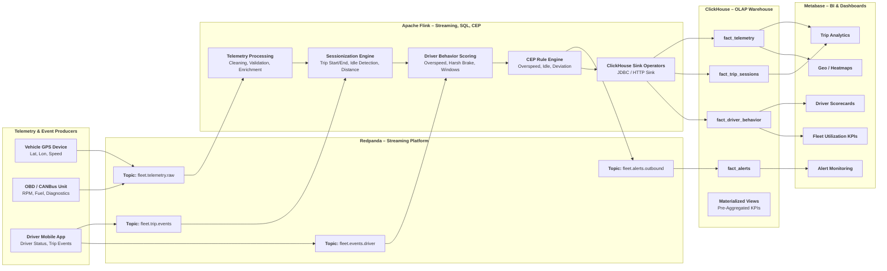
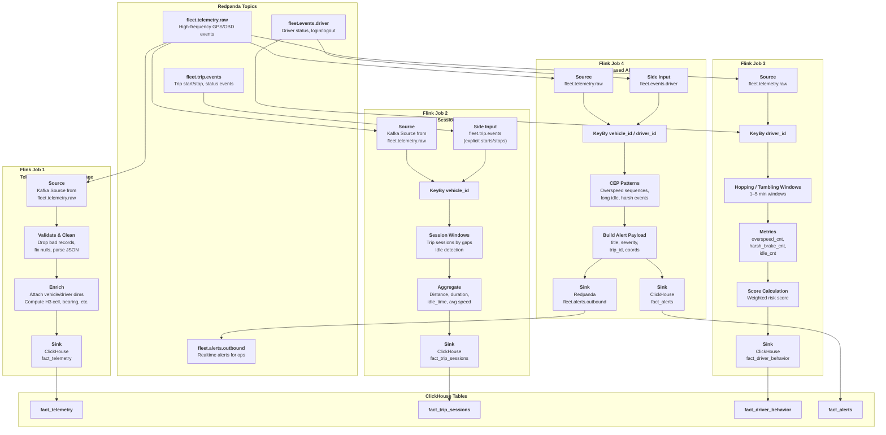
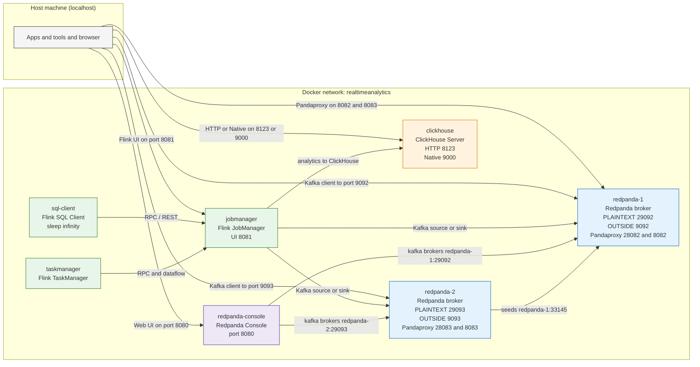
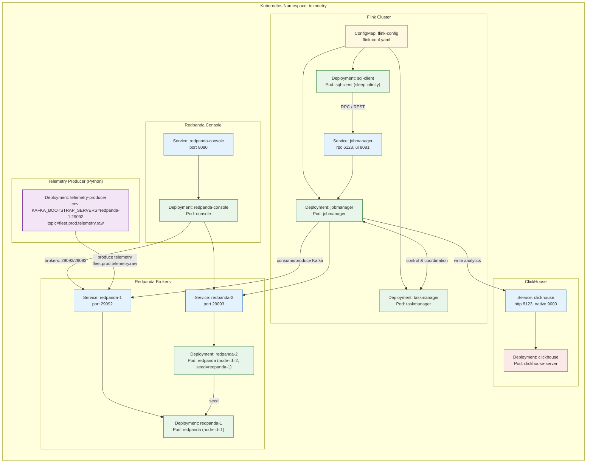

# Realtime Fleet Monitoring Analysis with Flink

A real-time analytics pipeline for vehicle telemetry, driver scoring, alerts, trip intelligence, and operational dashboards.

This project demonstrates how to build a production-grade fleet intelligence system using modern streaming technologies such as Apache Flink, Kafka/Redpanda, ClickHouse, Docker, and Kubernetes.

It captures raw telemetry from vehicles, processes it in real time, detects risky behaviors, computes trip/session analytics, raises alerts, and exposes the results via APIs and dashboards.

## Business Use Cases

### 1. Driver Behavior Monitoring

- Detect overspeeding, harsh braking, aggressive acceleration.
- Score drivers over rolling windows.
- Reduce accidents and insurance premiums.

### 2. Trip Intelligence

- Track trip start/end automatically.
- Compute distance, duration, idle time.
- Monitor ETA accuracy and route compliance.

### 3. Delivery Optimization

- Detect bottlenecks in last-mile delivery.
- Measure loading/unloading delays.
- Improve SLA adherence.

### 4. Fleet Utilization Insights

- Under-utilized vehicles.
- Multi-trip anomalies.
- Asset downtime monitoring.

### 6. Real-time Alerts & Operations Dashboard

- Overspeed alerts.
- Idling alerts.
- Geofence violations.
- SOS & crash detection.

## Architecture

---

| Layer                               | Component                                              | Purpose / Role                                                                 | Key Responsibilities                                                                                                                                                                                                          | Why This Component?                                                                                                                      |
| ----------------------------------- | ------------------------------------------------------ | ------------------------------------------------------------------------------ | ----------------------------------------------------------------------------------------------------------------------------------------------------------------------------------------------------------------------------- | ---------------------------------------------------------------------------------------------------------------------------------------- |
| **Ingestion Layer**                 | **Redpanda (Kafka-API Compatible Streaming Platform)** | High-throughput ingestion of telemetry, driver events, trip events, and alerts | • Accepts JSON telemetry events at high EPS • Durable, replicated event storage • Topic partitioning for parallel consumption • Acts as source of truth for raw events                                               | • Drop-in Kafka replacement but faster + simpler • No ZooKeeper • Low-latency writes suitable for IoT telemetry                    |
| **Stream Processing Layer**         | **Apache Flink (Streaming SQL + CEP)**                 | Real-time computation, enrichment, sessionization, and alerting                | • Windowed aggregations (tumble/hop/session) • Driver behavior scoring • Trip/session detection • CEP rules for overspeed, harsh brake • Data cleansing + transformations • Writes prepared data to ClickHouse | • Best stream processor for stateful workloads • Checkpoints, exactly-once semantics • SQL + Python + DataStream API flexibility   |
| **Storage / OLAP Layer**            | **ClickHouse (OLAP Columnar DB)**                      | Fast analytics + dashboards on telemetry data                                  | • Stores telemetry facts • Stores trip/session facts • Driver score marts • Alert history • Materialized views for aggregation • Sub-second queries for dashboards                                             | • Extremely fast for time-series & geo data • MergeTree handles millions of rows/sec • Affordable and scalable for fleet analytics |
| **Analytics / Visualization Layer** | **Metabase**                                           | BI dashboards + self-service exploration                                       | • Driver score dashboards • Trip KPIs • Alert trends • Heatmaps (with custom queries) • Ad hoc analysis for operations team                                                                                       | • Simple, free, and integrates directly with ClickHouse • Great for internal fleet operations dashboards                              |

### High Level Architecture

### Flink Pipelines and Clickhouse Architecture

### Docker Deployment

### Kubernetes Deployment

## Visuals

### Flink Dashboard

### Job Graph for Trip Summaries

### Details with Execution Plan, No of Records Received and Sent

### Redpanda Console with Topic Info

### Main Data Producer Topic with 500k+ Messages

