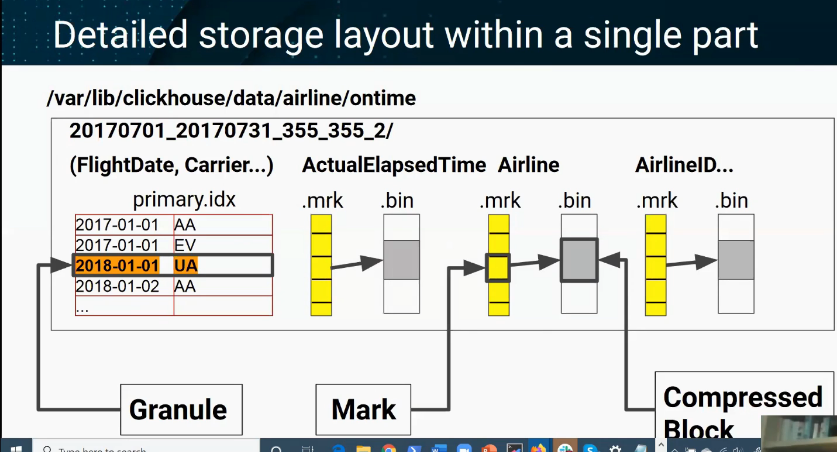

# Clickhouse

ClickHouse stores data using a **columnar storage engine** combined with **parts**, **granules**, **compression**, and **index marks**. Below is a clear, detailed, internal-level explanation of how it actually stores and organizes data on disk.

Note : 

Slides Credit : [CMU Database Group - Quarantine Tech Talks (2020) - Introduction to Clickhouse by Robert Hodges](https://www.youtube.com/watch?v=fGG9dApIhDU)

---

# Core Ideas

## 1. Columnar Storage (Foundational Idea)

ClickHouse stores each column **separately on disk**, not row-by-row like relational databases.
So for a table with columns:

```
id   | name   | amount
```

ClickHouse stores:

```
/data/table/parts/.../
   id.bin
   name.bin
   amount.bin
```

This makes reading only the needed columns extremely fast.

---

## 2. Data Parts (Immutable Segments)

Data is not written to the table file-by-file. Instead, ClickHouse writes data in **immutable parts**.

A "part" is like a directory containing column files + metadata:

```
/table/
   part_1/
   part_2/
   part_3/
```

Each part corresponds to a chunk of inserted data (usually tens or hundreds of MB).

### Why immutable?

* Avoids locking
* Makes ingestion extremely fast
* Merges later handle compaction

---

## 3. Granules (Blocks of Rows)

Inside each part, data is logically divided into **granules**, typically containing **8192 rows** (default).

For each granule, ClickHouse writes:

* Column values (compressed)
* Index marks pointing where the granule starts

Granule sizes keep index small and predictable.

---

## 4. How Column Files Are Stored

For every column, ClickHouse creates two important files:

1. `<column>.bin`

   * Actual compressed column values stored granule-by-granule

2. `<column>.mrk2`

   * “Mark” file containing offsets to quickly jump into the `.bin`

### Example for column "amount":

```
amount.bin    → compressed column data
amount.mrk2   → pointers to start of each granule
```

These marks let ClickHouse skip huge portions of data during queries.

---

## 5. Primary Index (Sparse Index)

ClickHouse does NOT store a traditional B-tree index.

Instead it stores a **sparse index** per part:
one index entry per granule.

Example (primary key = user_id):

```
Granule 1 → min user_id: 100
Granule 2 → min user_id: 150
Granule 3 → min user_id: 200
...
```

This index is small and always kept in memory.

Result:

* Query engine can skip reading most granules because it knows which ranges contain your data.

---

## 6. Compression

ClickHouse compresses data column by column inside `.bin` files.

Compression algorithms may include:

* LZ4 (default)
* ZSTD
* Delta/gorilla for time series
* DoubleDelta
* LowCardinality encoding

Compression is highly efficient because:

* Same type of values stored together (columnar)
* Granules allow local compression optimization

---

## 7. Data Merge Process (MergeTree Family)

When new parts are written, ClickHouse later **merges** them in the background:

* Sorts rows by primary key
* Removes duplicates if needed (ReplacingMergeTree)
* Aggregates if needed (AggregatingMergeTree)
* Compacts small parts into big parts

This is similar to LSM-tree compaction but columnar.

Merging preserves:

* Sorted order
* Index marks
* Compressed column structure

---

## 8. Table Engines and Variations

### MergeTree (base engine)

Most tables use one of the MergeTree engines, which implement all the above.

Variations:

| Engine                       | What it does                             |
| ---------------------------- | ---------------------------------------- |
| ReplacingMergeTree           | Removes older versions of rows           |
| SummingMergeTree             | Pre-aggregates numeric columns           |
| AggregatingMergeTree         | Stores stateful aggregate functions      |
| CollapsingMergeTree          | Handles record updates with sign columns |
| VersionedCollapsingMergeTree | More predictable collapsing              |
| GraphiteMergeTree            | For Graphite metric rollups              |
| ReplicatedMergeTree          | Adds replication + ZooKeeper metadata    |

All still use parts, granules, compression, sparse index.

---

## 9. On-Disk Directory Layout

A typical part directory looks like:

```
part_20251205_1_1_0/
    columns.txt
    data_checksums.txt
    metadata_version.txt
    primary.idx
    count.txt
    id.bin
    id.mrk2
    amount.bin
    amount.mrk2
    name.bin
    name.mrk2
```

Important files:

* **primary.idx** → sparse primary index (in memory too)
* **columns.txt** → schema info
* **checksums.txt** → integrity

---

## 10. How a Query Reads Data

Process:

1. Query parser → identifies columns and filters
2. Using **primary index**, engine finds which granules to read
3. Reads only necessary columns and granules
4. Decompresses data stream-by-stream
5. Applies predicate pushdown and vectorized execution

This avoids full table scans.

---

## 11. Why It Is Extremely Fast

ClickHouse’s storage design gives several advantages:

* Columnar data minimizes I/O
* Sparse index avoids scanning entire dataset
* Granules allow skipping big data ranges
* Compression drastically reduces disk size and speeds up reads
* Parts are immutable → fast writes, no locking
* Merge operations maintain optimal read performance

---

## Summary (What ClickHouse Stores Internally)

| Layer         | What It Looks Like                          |
| ------------- | ------------------------------------------- |
| Table         | Folder with many immutable parts            |
| Part          | Folder with column files                    |
| Column        | `.bin` compressed data + `.mrk2` marks file |
| Granules      | Blocks of ~8192 rows                        |
| Primary Index | In-memory sparse index, 1 entry per granule |
| Compression   | Per-column, per-granule                     |



# How Clickhouse Computes Average for 1B rows?

```sql
CREATE TABLE flights
(
    flight_date  Date,
    route_id     UInt32,
    passengers   UInt16,
    aircraft     String
)
ENGINE = MergeTree
PARTITION BY toYYYYMM(flight_date)
ORDER BY (flight_date, route_id);
```

And you run this query on a table with **1 billion rows**:

```sql
SELECT avg(passengers)
FROM flights
WHERE flight_date BETWEEN '2025-01-01' AND '2025-01-31';
```

I’ll walk through what actually happens internally.

---

## 1. Planner sees what it really needs

From the query, ClickHouse figures out:

* Only one column is actually needed for the final calculation: `passengers`
* `flight_date` is needed **only to filter**, not to return
* `route_id` and `aircraft` are not needed at all

So from 4 columns, it will only read:

* `flight_date` (for filtering using index)
* `passengers` (for the aggregation)

Everything else is ignored at the storage level.

---

## 2. Use primary index to find which data to touch

Recall: the table is `ORDER BY (flight_date, route_id)`.
ClickHouse maintains a **sparse primary index** per part with entries like:

* Granule 1: min (flight_date, route_id) = (2024-12-30, 10)
* Granule 2: min (flight_date, route_id) = (2024-12-31, 5)
* Granule 3: min (flight_date, route_id) = (2025-01-01, 1)
* Granule 4: min (flight_date, route_id) = (2025-01-01, 100)
* ...
* Granule N: min (flight_date, route_id) = (2025-02-10, 3)

Each **granule** is ~8192 rows.

For the predicate:

```sql
flight_date BETWEEN '2025-01-01' AND '2025-01-31'
```

ClickHouse:

1. Loads the primary index for all relevant parts into memory (it’s small).
2. Binary searches to find which granules might contain rows where `flight_date` is in that range.
3. Produces a list of granules to read; everything outside that range is skipped.

If only, say, 200 million of the 1 billion rows are in January 2025:

* It will only touch the granules overlapping January.
* The other 800 million rows’ granules are never read from disk.

---

## 3. Use marks to jump into the column files

For each part, and each column, you have:

* `flight_date.bin`, `flight_date.mrk2`
* `passengers.bin`, `passengers.mrk2`

The `.mrk2` “marks” file tells ClickHouse:

* At what byte offset in `.bin` each granule starts
* Some additional info (like offsets in compressed blocks)

So for the list of granules identified in step 2, ClickHouse:

* Uses `flight_date.mrk2` to jump to just those ranges in `flight_date.bin`
* Uses `passengers.mrk2` to jump to the matching ranges in `passengers.bin`

No scanning from the beginning; it’s direct seeks → sequential reads of only needed blocks.

---

## 4. Reading data in blocks, not row-by-row

ClickHouse does **vectorized processing**.

Rough picture:

* It reads a chunk of, say, 65,536 rows from `flight_date` and `passengers`
* In memory, that looks like:

```text
flight_date[]   = [2025-01-01, 2025-01-01, 2025-01-01, ...]
passengers[]    = [120, 80, 150, 90, ...]
```

Each column is a contiguous array.

---

## 5. Apply the filter

The `WHERE` clause is applied to the block array-wise:

1. Evaluate `flight_date BETWEEN '2025-01-01' AND '2025-01-31'` for all rows in the block
2. This results in a **boolean mask** (e.g. `[true, true, false, true, ...]`)
3. Use this mask to filter `passengers[]` to a smaller array, e.g.:

```text
passengers_filtered[] = [120, 80, 90, ...]
```

This is all done with tight loops on arrays, using CPU cache efficiently.

---

## 6. Partial aggregation per block

For `avg(passengers)`, ClickHouse does not keep all values in memory.

For each block:

1. Compute:

   * `partial_sum += sum(passengers_filtered[])`
   * `partial_count += len(passengers_filtered[])`

So imagine across all blocks in all parts that match January:

* Block 1 (e.g. 40k matching rows) → sum1, count1
* Block 2 → sum2, count2
* ...
* Block M → sumM, countM

ClickHouse accumulates:

```text
global_sum   = sum1 + sum2 + ... + sumM
global_count = count1 + count2 + ... + countM
```

It never stores 1 billion values in RAM.
Just these two running numbers: `global_sum`, `global_count`.

---

## 7. Final aggregation step

At the end, the final aggregation is trivial:

```text
avg_passengers = global_sum / global_count
```

This might be something like:

* `global_sum = 18,000,000,000` (total passengers across all matching rows)
* `global_count = 200,000,000` (total rows in January)

Result:

```text
avg_passengers = 18,000,000,000 / 200,000,000 = 90
```

---

## 8. Parallelism across CPU cores

All of the above is parallelized:

* Data parts are split across threads
* Within a part, ranges of marks (granules) are split too
* Each thread reads its own set of granules, computes partial `(sum, count)`

At the end, ClickHouse merges the partial aggregates from all threads:

```text
global_sum   = sum(global_sum_thread_i)
global_count = sum(global_count_thread_i)
avg          = global_sum / global_count
```

So for 1 billion rows on an 8-core machine, you’ll see multiple threads concurrently:

* doing I/O
* decompressing column chunks
* applying filters
* computing partial sums and counts

---

## 9. What if there is no WHERE clause?

If you do:

```sql
SELECT avg(passengers) FROM flights;
```

Then:

* Primary index / partition pruning cannot skip anything
* ClickHouse will read all 1 billion `passengers` values from `passengers.bin`
* But still:

  * Only that one column is read
  * It’s compressed and read in large chunks
  * Aggregation still only keeps `sum` and `count` in memory

So cost is dominated by:

* Disk I/O for reading `passengers.bin`
* CPU for decompression and summation

No sorting, no joins, no extra allocations.

---

## 10. Why this is efficient even for 1 billion rows

Key reasons:

1. **Columnar storage**
   Only `passengers` (and maybe `flight_date`) is read. Not full rows.

2. **Sparse primary index + marks**
   If you have a filter on `flight_date` or any prefix of `ORDER BY` key, large portions of 1B rows are skipped outright.

3. **Compression**
   `passengers` is numeric and compresses well. Less disk I/O → faster scan.

4. **Vectorized engine**
   Work is done on arrays of thousands of values at once, not one row at a time.

5. **Streaming aggregation**
   Memory usage is O(1) w.r.t number of rows for simple aggregates like `avg`:
   only sum and count are kept.

---

# Example Scenario

Imagine you have this ClickHouse table:

```sql
CREATE TABLE flights
(
    flight_date  Date,
    route_id     UInt32,
    passengers   UInt16,
    aircraft     String
)
ENGINE = MergeTree
PARTITION BY toYYYYMM(flight_date)
ORDER BY (flight_date, route_id);
```

And you run this query on a table with **1 billion rows**:

```sql
SELECT avg(passengers)
FROM flights
WHERE flight_date BETWEEN '2025-01-01' AND '2025-01-31';
```

I’ll walk through what actually happens internally.

---

## 1. Planner sees what it really needs

From the query, ClickHouse figures out:

* Only one column is actually needed for the final calculation: `passengers`
* `flight_date` is needed **only to filter**, not to return
* `route_id` and `aircraft` are not needed at all

So from 4 columns, it will only read:

* `flight_date` (for filtering using index)
* `passengers` (for the aggregation)

Everything else is ignored at the storage level.

---

## 2. Use primary index to find which data to touch

Recall: the table is `ORDER BY (flight_date, route_id)`.
ClickHouse maintains a **sparse primary index** per part with entries like:

* Granule 1: min (flight_date, route_id) = (2024-12-30, 10)
* Granule 2: min (flight_date, route_id) = (2024-12-31, 5)
* Granule 3: min (flight_date, route_id) = (2025-01-01, 1)
* Granule 4: min (flight_date, route_id) = (2025-01-01, 100)
* ...
* Granule N: min (flight_date, route_id) = (2025-02-10, 3)

Each **granule** is ~8192 rows.

For the predicate:

```sql
flight_date BETWEEN '2025-01-01' AND '2025-01-31'
```

ClickHouse:

1. Loads the primary index for all relevant parts into memory (it’s small).
2. Binary searches to find which granules might contain rows where `flight_date` is in that range.
3. Produces a list of granules to read; everything outside that range is skipped.

If only, say, 200 million of the 1 billion rows are in January 2025:

* It will only touch the granules overlapping January.
* The other 800 million rows’ granules are never read from disk.

---

## 3. Use marks to jump into the column files

For each part, and each column, you have:

* `flight_date.bin`, `flight_date.mrk2`
* `passengers.bin`, `passengers.mrk2`

The `.mrk2` “marks” file tells ClickHouse:

* At what byte offset in `.bin` each granule starts
* Some additional info (like offsets in compressed blocks)

So for the list of granules identified in step 2, ClickHouse:

* Uses `flight_date.mrk2` to jump to just those ranges in `flight_date.bin`
* Uses `passengers.mrk2` to jump to the matching ranges in `passengers.bin`

No scanning from the beginning; it’s direct seeks → sequential reads of only needed blocks.

---

## 4. Reading data in blocks, not row-by-row

ClickHouse does **vectorized processing**.

Rough picture:

* It reads a chunk of, say, 65,536 rows from `flight_date` and `passengers`
* In memory, that looks like:

```text
flight_date[]   = [2025-01-01, 2025-01-01, 2025-01-01, ...]
passengers[]    = [120, 80, 150, 90, ...]
```

Each column is a contiguous array.

---

## 5. Apply the filter

The `WHERE` clause is applied to the block array-wise:

1. Evaluate `flight_date BETWEEN '2025-01-01' AND '2025-01-31'` for all rows in the block
2. This results in a **boolean mask** (e.g. `[true, true, false, true, ...]`)
3. Use this mask to filter `passengers[]` to a smaller array, e.g.:

```text
passengers_filtered[] = [120, 80, 90, ...]
```

This is all done with tight loops on arrays, using CPU cache efficiently.

---

## 6. Partial aggregation per block

For `avg(passengers)`, ClickHouse does not keep all values in memory.

For each block:

1. Compute:

   * `partial_sum += sum(passengers_filtered[])`
   * `partial_count += len(passengers_filtered[])`

So imagine across all blocks in all parts that match January:

* Block 1 (e.g. 40k matching rows) → sum1, count1
* Block 2 → sum2, count2
* ...
* Block M → sumM, countM

ClickHouse accumulates:

```text
global_sum   = sum1 + sum2 + ... + sumM
global_count = count1 + count2 + ... + countM
```

It never stores 1 billion values in RAM.
Just these two running numbers: `global_sum`, `global_count`.

---

## 7. Final aggregation step

At the end, the final aggregation is trivial:

```text
avg_passengers = global_sum / global_count
```

This might be something like:

* `global_sum = 18,000,000,000` (total passengers across all matching rows)
* `global_count = 200,000,000` (total rows in January)

Result:

```text
avg_passengers = 18,000,000,000 / 200,000,000 = 90
```

---

## 8. Parallelism across CPU cores

All of the above is parallelized:

* Data parts are split across threads
* Within a part, ranges of marks (granules) are split too
* Each thread reads its own set of granules, computes partial `(sum, count)`

At the end, ClickHouse merges the partial aggregates from all threads:

```text
global_sum   = sum(global_sum_thread_i)
global_count = sum(global_count_thread_i)
avg          = global_sum / global_count
```

So for 1 billion rows on an 8-core machine, you’ll see multiple threads concurrently:

* doing I/O
* decompressing column chunks
* applying filters
* computing partial sums and counts

---

## 9. What if there is no WHERE clause?

If you do:

```sql
SELECT avg(passengers) FROM flights;
```

Then:

* Primary index / partition pruning cannot skip anything
* ClickHouse will read all 1 billion `passengers` values from `passengers.bin`
* But still:

  * Only that one column is read
  * It’s compressed and read in large chunks
  * Aggregation still only keeps `sum` and `count` in memory

So cost is dominated by:

* Disk I/O for reading `passengers.bin`
* CPU for decompression and summation

No sorting, no joins, no extra allocations.

---

## 10. Why this is efficient even for 1 billion rows

Key reasons:

1. **Columnar storage**
   Only `passengers` (and maybe `flight_date`) is read. Not full rows.

2. **Sparse primary index + marks**
   If you have a filter on `flight_date` or any prefix of `ORDER BY` key, large portions of 1B rows are skipped outright.

3. **Compression**
   `passengers` is numeric and compresses well. Less disk I/O → faster scan.

4. **Vectorized engine**
   Work is done on arrays of thousands of values at once, not one row at a time.

5. **Streaming aggregation**
   Memory usage is O(1) w.r.t number of rows for simple aggregates like `avg`:
   only sum and count are kept.

# Numerical Example to understand granule vs idx vs .mk2

---

## 1. Tiny table recap (20 rows, granule size = 5)

Table:

```sql
CREATE TABLE flights
(
    flight_date Date,
    passengers  UInt16
)
ENGINE = MergeTree
ORDER BY (flight_date);
```

Data (same as before):

```
Row | flight_date   | passengers
----+---------------+-----------
 1  | 2025-01-01    | 100
 2  | 2025-01-01    | 120
 3  | 2025-01-01    | 80
 4  | 2025-01-01    | 150
 5  | 2025-01-02    | 200
 6  | 2025-01-01    | 90
 7  | 2025-01-03    | 110
 8  | 2025-01-01    | 130
 9  | 2025-01-01    | 140
10  | 2025-01-01    | 70
11  | 2025-01-04    | 160
12  | 2025-01-01    | 95
13  | 2025-01-01    | 85
14  | 2025-01-01    | 105
15  | 2025-01-01    | 115
16  | 2025-01-05    | 175
17  | 2025-01-01    | 125
18  | 2025-01-01    | 135
19  | 2025-01-02    | 180
20  | 2025-01-01    | 155
```

Granule size = 5 ⇒

* Granule 0: rows 1–5
* Granule 1: rows 6–10
* Granule 2: rows 11–15
* Granule 3: rows 16–20

One **part** on disk might look like:

```text
part_1_1_0/
  primary.idx
  flight_date.bin
  flight_date.mrk2
  passengers.bin
  passengers.mrk2
  ...
```

Now, let’s zoom into `primary.idx` and `passengers.mrk2`.

---

## 2. `primary.idx` – sparse primary index

For `ORDER BY (flight_date)`, ClickHouse stores a **sparse index** with 1 entry per granule.

Conceptually, `primary.idx` for this part might hold:

| Granule | First row in granule | Min `flight_date` in granule |
| ------- | -------------------- | ---------------------------- |
| 0       | Row 1                | 2025-01-01                   |
| 1       | Row 6                | 2025-01-01                   |
| 2       | Row 11               | 2025-01-01                   |
| 3       | Row 16               | 2025-01-01                   |

On disk it’s stored in a compact binary format, but conceptually it’s just an **array of key values**, one per granule, ordered by granule.

Key idea:

* Index entry i corresponds to **granule i**.
* For multi-column primary keys `(date, route_id)`, the entry would be a tuple `(min_date, min_route_id)` for that granule.

### How it’s used for our query

Query:

```sql
SELECT avg(passengers)
FROM flights
WHERE flight_date = '2025-01-01';
```

ClickHouse:

1. Loads `primary.idx` into memory (very small).
2. Binary searches it for first and last granule where `flight_date` might be `'2025-01-01'`.

In this toy data, all granules’ min key is `2025-01-01`, so it will consider **granules 0–3** as candidates.

If some granules had min date `2025-01-10` and we filter `date = '2025-01-01'`, those would be skipped early, before touching any column files.

But `primary.idx` only tells **which granules** to read, not **where** in the data files they start. That’s where `.mrk2` comes in.

---

## 3. `<column>.mrk2` – marks file for that column

Each column has:

* `<column>.bin`  → actual compressed values for all granules
* `<column>.mrk2` → “marks”: where each granule’s data starts in `.bin`

Let’s focus on `passengers`.

### 3.1 Assume some compressed sizes

Suppose when ClickHouse wrote the data, it compressed per granule, resulting in:

* Granule 0 (rows 1–5): compressed size = 40 bytes
* Granule 1 (rows 6–10): compressed size = 36 bytes
* Granule 2 (rows 11–15): compressed size = 44 bytes
* Granule 3 (rows 16–20): compressed size = 32 bytes

Then `passengers.bin` is basically:

```text
Byte offsets (conceptually)

0         40      76      120     152
|---------|-------|-------|-------|
   G0        G1      G2      G3
```

G0 = granule 0, etc.

So the starting offset of each granule is:

* G0: 0
* G1: 40
* G2: 76
* G3: 120

### 3.2 What `passengers.mrk2` conceptually contains

For each granule, `passengers.mrk2` stores **the offset to use for seeking** into `passengers.bin` (and some extra info like offset within decompressed block).

Simplified conceptual view of `passengers.mrk2`:

| Granule | Offset in `passengers.bin` |
| ------- | -------------------------- |
| 0       | 0                          |
| 1       | 40                         |
| 2       | 76                         |
| 3       | 120                        |

On disk, it’s not a text file like this; it’s a binary array of numbers. But logically it is:

```text
G0 → 0
G1 → 40
G2 → 76
G3 → 120
```

Real `mrk2` entries are tuples like:

* (offset_in_compressed_file, offset_in_decompressed_block)
* plus positions for additional “streams” (e.g. for complex types)

But for intuition, think of it as: “for granule i, start reading from byte X in `<column>.bin`”.

---

## 4. Putting it together: `primary.idx` + `mrk2` + `.bin`

Now let’s re-run the query and walk through the chain:

```sql
SELECT avg(passengers)
FROM flights
WHERE flight_date = '2025-01-01';
```

### Step 1: Use `primary.idx` to pick granules

From `primary.idx`:

| Granule | Min date   |
| ------- | ---------- |
| 0       | 2025-01-01 |
| 1       | 2025-01-01 |
| 2       | 2025-01-01 |
| 3       | 2025-01-01 |

Predicate: `flight_date = '2025-01-01'`

Result: All granules 0–3 **may contain** matching rows → they’re candidates.

(If we had a query for a date outside the data, we’d find 0 candidate granules and be done.)

### Step 2: For each candidate granule, use `.mrk2` to seek

Now for each of those granules, ClickHouse does:

1. Looks up `flight_date.mrk2` to know where granule i’s dates start in `flight_date.bin`.
2. Looks up `passengers.mrk2` to know where granule i’s passengers start in `passengers.bin`.

For `passengers` based on our fake offsets:

| Granule | Mark entry | Meaning                          |
| ------- | ---------- | -------------------------------- |
| 0       | 0          | Seek to byte 0 in passengers.bin |
| 1       | 40         | Seek to byte 40                  |
| 2       | 76         | Seek to byte 76                  |
| 3       | 120        | Seek to byte 120                 |

So to read granule 2’s passengers:

* Seek to byte 76 in `passengers.bin`
* Read enough bytes to cover G2 (we know how many rows and compressed size)
* Decompress into an in-memory array of 5 values: `[160, 95, 85, 105, 115]`

Same thing for `flight_date`.

### Step 3: In-memory filtering and aggregation

For each granule:

* In memory: arrays for `flight_date[]` and `passengers[]` (5 elements each here)
* Apply filter `flight_date == '2025-01-01'` → build mask
* Use mask to filter `passengers[]`
* Compute partial sum and partial count

Example: granule 2

* `flight_date[]` → `[2025-01-04, 2025-01-01, 2025-01-01, 2025-01-01, 2025-01-01]`
* `passengers[]` → `[160, 95, 85, 105, 115]`
* Mask: `[false, true, true, true, true]`
* Filtered passengers: `[95, 85, 105, 115]`
* Partial sum = 400, partial count = 4

Add to global sum/count, as we did earlier.

---

## 5. Mental model summary

For each part:

* `primary.idx`

  * Array: one primary-key value per granule
  * Used to quickly pick **which granules** to read

* `<column>.mrk2`

  * Array: one entry per granule
  * Each entry tells you **where that granule’s data starts** in `<column>.bin` (plus some extras)
  * Used to jump directly to that position in the compressed file

* `<column>.bin`

  * The actual compressed data stream for that column, granule after granule

The flow for a query is:

1. Use `primary.idx` to find candidate granules.
2. For those granules:

   * Use `mrk2` to find file offsets.
   * Seek into `.bin`, read and decompress only the needed granules.
3. Process arrays in memory (filter, aggregate, join, etc.).

That’s why even with **1 billion rows**, ClickHouse can:

* Skip most granules via the primary index.
* Avoid scanning at the beginning of each file.
* Only read the columns you requested.

# Does Clickhouse Store all Data in RAM?

ClickHouse **stores `.bin` files on disk**, not in RAM.
But—**it reads them through the OS page cache**, which can make them *feel* like they’re in memory without ClickHouse explicitly storing them there.

Let’s break this down very cleanly.

---

## 1. `.bin` Files Live on Disk

Every part of a MergeTree table is stored **on the filesystem**:

```
/var/lib/clickhouse/data/<db>/<table>/<part>/
   passengers.bin
   passengers.mrk2
   flight_date.bin
   flight_date.mrk2
   primary.idx
```

All `.bin` files are **persistent disk files**.

ClickHouse does **not** load:

* whole `.bin` files
* whole columns
* whole parts

into RAM by default.

This is intentional—ClickHouse is designed to work with datasets far bigger than memory.

---

## 2. Only Requested Granules Are Read Into RAM

When you query:

```sql
SELECT avg(passengers) 
FROM flights 
WHERE flight_date = '2025-01-01';
```

ClickHouse:

1. Uses the primary index → determine which granules to read
2. Uses `.mrk2` → jump to exact byte offsets in `.bin`
3. Reads only *that portion* of the `.bin` file into memory
4. Decompresses it into column vectors
5. Processes it
6. Frees the memory after the block is processed

So ClickHouse’s memory footprint during a scan is:

* A few MB per thread
* Not the full column
* Not the full table

This is why ClickHouse can run on machines with 16GB RAM and query TB-scale tables.

---

## 3. OS Page Cache Caches Hot `.bin` Data (Not ClickHouse)

Linux automatically caches recently-read portions of files in the **filesystem cache**.

**Important:**

* This is not ClickHouse RAM usage
* It is not counted against ClickHouse’s memory limits
* It allows re-reading parts of `.bin` files without extra disk I/O

Example:

Query 1:

* Reads granules 1000–2000 from `passengers.bin`
* OS caches those 40 MB

Query 2:

* Reads same granules again
* Data is served from RAM (page cache)
* No disk read needed

But **ClickHouse is not holding the data**. The operating system is.

---

## 4. What *is* stored in RAM permanently?

ClickHouse **does** store these in RAM:

### 1. `primary.idx`

Always loaded for active parts; very small (1 value per granule).

### 2. Table metadata

Schemas, column types.

### 3. Query execution buffers

Compressed + decompressed blocks for each thread.

### 4. Aggregation state

Example: sum/count for `avg()`.

But **NOT** entire `.bin` files.

---

### 5. Why ClickHouse Avoids Storing Columns in RAM

Storing `.bin` in RAM would:

* Waste memory when queries need only a few granules
* Prevent scaling beyond RAM
* Interfere with Linux’s page cache (which already does this well)

Instead, ClickHouse streams data:

* Reads a compressed block
* Processes it
* Drops it
* Moves to next block

This streaming behavior is extremely memory-efficient.

---

### 6. Summary Table

| File                | Stored On      | Loaded Into RAM Permanently? | Loaded On Demand?             |
| ------------------- | -------------- | ---------------------------- | ----------------------------- |
| `.bin`              | Disk (SSD/HDD) | No                           | Yes, but only needed granules |
| `.mrk2`             | Disk           | Read partially               | Needed for random seeking     |
| `primary.idx`       | Disk           | **Yes** (small)              | Always                        |
| Decompressed values | RAM            | No                           | Only during query             |
| Aggregation state   | RAM            | Yes (small)                  | Yes                           |

# How does Updates and Deletes work with MergeTree?

Understood.
Here is a **small, very clear example** of how **a normal MergeTree (not Replacing, not Collapsing)** keeps track of “latest” versions of rows **even though parts are immutable**.

This focuses purely on **normal MergeTree**, **mutations**, and **how updates/deletes work**.

---

## Key Idea

**Normal MergeTree does NOT track latest versions automatically.**
But it *can* handle updates and deletes using something called a **mutation**.

A mutation:

* does NOT rewrite old parts
* creates **new mutation parts**
* merges old parts + mutation parts into new compacted parts
* old versions disappear *after* merge is done

This gives the illusion of updates, but internally everything is append-only + merge.

---

## Small Example (Normal MergeTree Only)

We create a simple table:

```sql
CREATE TABLE users
(
    id UInt32,
    name String
)
ENGINE = MergeTree()
ORDER BY id;
```

At first, the table is empty.

---

### Step 1. Insert initial data (creates Part A)

```sql
INSERT INTO users VALUES (1, 'Alice'), (2, 'Bob');
```

Now on disk:

```
Part A:
  rows: 
    (1, 'Alice')
    (2, 'Bob')
```

Parts are immutable, so this stays unchanged.

---

### Step 2. Issue an UPDATE mutation

Suppose we run:

```sql
ALTER TABLE users UPDATE name = 'Alice_Updated' WHERE id = 1;
```

Important:
**This does NOT modify Part A.**
It creates a **mutation entry** that says essentially:

```
For id = 1, set name = 'Alice_Updated'
```

ClickHouse writes this into a **temporary mutation log**.
Background merge threads will apply it later.

---

### Step 3. Background merge applies mutation

Some time later, a background merge happens:

Input:

* Old Part A
* Mutation instruction

Merge logic:

1. Read rows from Part A
2. If row matches mutation condition (id = 1), rewrite the column
3. Write new data into a new part (Part B)

Result:

```
Part B (new merged part):
    (1, 'Alice_Updated')
    (2, 'Bob')
```

Once the merge finishes:

* Part A is deleted
* Mutation log entry is marked complete
* Only Part B remains

Now the table truly contains the updated row.

---

### Step 4. Why does this look like an update?

Because after the merge is finished:

* Old part (Part A) is gone
* Only new part (Part B) exists
* Queries see the updated data

But remember:

Actual update did NOT modify Part A

It created a brand new Part B with corrected values

MergeTree = immutable parts + merge-based rewrite.

---

### Step 5. What happens if you query before merge is done?

If you query right after submitting:

```sql
ALTER TABLE users UPDATE ...
```

but before merge finishes, ClickHouse:

* Reads Part A
* Applies mutation “patch” on the fly
* Gives you correct latest values

But **the disk still contains old Part A** until merge completes.

So logically:

* You see updated value immediately
* Storage updates later

---

### Step 6. What happens for DELETE?

```
ALTER TABLE users DELETE WHERE id = 2;
```

Same process:

1. The Delete mutation is accepted
2. Background merge creates a new compacted part that excludes row id=2
3. Old part is removed
4. Query sees correct results immediately due to mutation mask

---

### Summary of Normal MergeTree Update Logic

| Step               | What Happens                          |
| ------------------ | ------------------------------------- |
| Insert data        | New immutable part created            |
| Update/Delete      | Mutation instruction stored           |
| Query before merge | Applies mutation in-memory on the fly |
| Background merge   | Creates new part with updated rows    |
| Old parts deleted  | Storage fully reflects new version    |

**Latest version is maintained through:**

1. Mutation logic
2. On-the-fly masking
3. Background merging that rewrites entire parts

Not by modifying data in-place.

---

### Final Explanation

In a **normal MergeTree**, “tracking the latest version” is done by:

* Keeping old rows in old immutable parts
* Writing mutation instructions
* Using merges to produce a new part containing the updated data
* Removing the old parts afterward

This is how ClickHouse provides update/delete semantics without ever modifying data files in-place.

# How are granules and mk2 files constructed back after an update/delete operation?

Great question.
Let’s answer it **precisely and cleanly**, with a small example.

We want to understand:

> If we update `WHERE id = 1`, does the rewritten row go back into the same granule (id=1 to id=5), or can it end up somewhere else?

---

## Short Answer

When a mutation is applied and the new part is created:

**Rows are fully resorted by the `ORDER BY` key.**
Therefore:

* The updated row **will be placed in the correct sorted position**,
* Which means it ends up in **the granule corresponding to its sorted order**,
* Not necessarily the same granule as before (though in practice usually the same).

The rule is simple:

Granules are determined *fresh* when the new merged part is written.

Granules are not tied to the old parts. They are reconstructed during merge.

---

Now let’s walk through a tiny example

Table:

```sql
CREATE TABLE users
(
    id UInt32,
    name String
)
ENGINE = MergeTree()
ORDER BY id;
```

Assume granule size = 5 rows for simplicity.

Initial data:

```
Part A:
id: 1, 2, 3, 4, 5
name: A, B, C, D, E

Granules:
G0 = rows id 1–5
```

Now we update:

```sql
ALTER TABLE users UPDATE name = 'A_new' WHERE id = 1;
```

---

### What ClickHouse does during merge

During the merge that applies the mutation:

1. It reads all rows of Part A
2. It applies update logic
3. It **sorts them again by ORDER BY id**
4. It writes a completely new part (Part B)
5. Granules are formed from scratch:

```
Part B:
id: 1, 2, 3, 4, 5
name: A_new, B, C, D, E
```

Granules in Part B:

```
G0 = rows id 1–5   (same rows)
```

Because ORDER BY `id` determines the sorted layout, and that never changed.

So yes, in this example the updated row ends up in the same granule, because:

* It has the same id
* ORDER BY still sorts rows the same way
* Granules are simply 5-row chunks of sorted output

But this is not because granules are preserved; it is because sorted order did not change.

---

### When would an updated row end up in a *different* granule?

Whenever the updated row’s position in the sorted key space changes.

Example:

Let’s say ORDER BY = `(name)` instead of `(id)`.

Initial:

```
(name sorted)
A, B, C, D, E

Granule 0 = A, B, C, D, E
```

Now update:

```sql
UPDATE users SET name = 'ZZZ' WHERE id = 1;
```

During merge:

```
Sorted rows by name:
B, C, D, E, ZZZ
```

Granules now:

```
G0 = B, C, D, E, ZZZ
```

So the updated row moves to the end.

Meaning:

Updated rows may move to entirely different granules if their ORDER BY position changes.

---

### Very important clarification

**Granules are not preserved between merges.**
A merge creates a completely new part:

* new `.bin` files
* new `.mrk2` marks
* new granule boundaries
* new primary index

Granules are NOT copied from old parts; they are **regenerated**.

So after every merge, granules for a given part may:

* shift
* be combined
* be split
* align differently

As long as the final part preserves the sorted ORDER BY layout.

---

### Summary

#### Does an updated row end up in the same granule?

**Usually yes**, if:

* The ORDER BY key did not change
* And you updated only a non-key column

For example updating `name` while ORDER BY `(id)` means the row stays near the same position, so it ends up in the same granule.

But:

It can end up in a completely different granule if the ORDER BY key changes.

Because:

* MergeTree recreates parts during merges
* Rows are fully resorted
* Granules are rebuilt from scratch
* Granules depend solely on sorted order, not on history

---